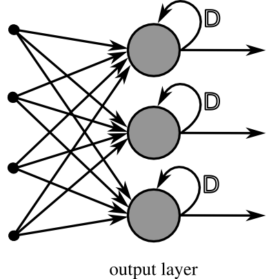

# Recurrent Neural Networks (RNNs)

---

Las Redes Neuronales Recurrentes, comúnmente conocidas como RNNs, son una herramienta esencial en el ámbito de la inteligencia artificial y el aprendizaje automático. Su principal utilidad radica en **la detección de patrones en los datos**, lo que las hace especialmente útiles en una amplia gama de aplicaciones, desde la interpretación de la escritura manual hasta el análisis del genoma.

A un nivel más alto usamos las RNNs para modelar y generar texto, reconocer voz, generar descripciones de imágenes y etiquetar videos. Esto se debe a su particular estructura, que difiere de las redes FeedForward por su capacidad para inyectar información de vuelta en sí misma, generando ciclos de información que permiten **un aprendizaje más profundo y complejo**.

<figure markdown="span">
    
</figure>

Un componente clave en este proceso es el algoritmo de Backpropagation Through Time (BPTT), una adaptación de los algoritmos de retropropagación que permite a las RNNs "propagar" correctamente el error a través de la red. Sin embargo, este método puede volverse inestable si se recurre a él demasiadas veces. Para solucionar este problema, se suele **truncar la función**, ignorando los elementos pasados de un cierto límite para evitar la inestabilidad.

### Problema Vanishing y exploding gradients

---

No obstante, las RNNs no están exentas de problemas. Uno de los mayores retos son los *vanishing & exploding gradients*. Este problema surge debido a la forma en que funcionan las operaciones de recurrencia. Si se implican valores muy pequeños en estas operaciones, el gradiente se reducirá hasta el punto de que los estados obtenidos anteriormente durante el entrenamiento serán prácticamente invisibles.

Para combatir este problema, se desarrollaron las Long Short-Term Memory Units (LSTMs). 

### Long Short-Term Memory Units(LSTMs)

---

Las LSTMs almacenan información fuera de la red neuronal en estructuras llamadas *gated cells*. Las operaciones disponibles entre la red neuronal y un LSTM son LEER, ESCRIBIR y OLVIDAR, lo que permite una gestión más eficiente de la información a lo largo del tiempo.

### Deep Recurrent Neural Networks(DRNNs)

---

Existen también variaciones más complejas de las RNNs, como las Deep Recurrent Neural Networks (DRNNs), que son uniones de varias RNNs ordinarias. Estas redes existirían como un mismo conjunto de capas($l$) donde el estado oculto ($H^{(l)}$) de una red se usaría como input para la siguiente capa($H^{(l+1)}$). 

###Bidirectional Recurrent Neural Networks(BRNNs)

---

Las Bidirectional Recurrent Neural Networks (BRNNs), que permiten rellenar huecos de información utilizando información posterior.

### Encoder-Decoder Architecture & Sequence to Sequence(seq2seq)

---

La E-DA es una arquitectura de red neuronal que consiste en una *encoder* red y una *decoder* red que se dedican a codificar la entrada en un estado y descodificar el estado en una salida. En esta arquitectura los estados ocultos del *encoder* se envían a los estados ocultos del *decoder*.

Se centra en asignar una secuencia de entrada de longitud $n$ fija a una secuencia de entrada de longitud $m$ fija.
Una manera de realizar esta arquitectura es organizando los modelos *encoder* *decoder* de tal manera que haya entre su comunicación un Vector de Codificación(*Encoder Vector*). Este vector se encargaría de recibir el último estado de la red *encoder* y comunicárselos a la red *decoder*. Esta arquitectura presenta un cuello de botella en el *Encoder Vector* cuando las entradas tenían demasiados componentes, los abordajes a este problema en el siguiente apartado:

### Attention Mechanism & Transformer

---

Está inspirada en parte por la visión humana, ya que esta es capaz de obtener mucha información de un punto en el que se está centrado mientras se conserva una visión periférica. Basándonos en esta idea de alta resolución en una parte y una baja resolución en los objetos adyacentes podemos aumentar el rendimiento.

En cuanto al funcionamiento, utiliza dos sentencias de entrada y las convierte en una matriz de relevancia. Por ejemplo: queremos traducir la frase: The red apple, cada palabra sería una fila, y de su traducción: La manzana roja, cada palanbra sería una columna, haciendo una matriz de 3x3. Ahora indicaríamos las palabras que tienen relevancia entre ellas para con nuestro objetivo:

|  | The | red | apple |
| --- | --- | --- | --- |
| La | 1 | 0 | 0 |
| manzana | 0 | 0 | 1 |
| roja | 0 | 1 | 0 |

Este tipo de tabla también se puede realizar para una misma frase (*self-attention*).  En este ejemplo se indica cuanta “atención” debería dedicarle una palabra a otra.

|  | Me | como | una | manzana | roja |
| --- | --- | --- | --- | --- | --- |
| Me | 0.1 | 0.3 | 0.1 | 0.2 | 0.3 |
| como | 0.3 | 0.1 | 0..4 | 0.5 | 0.2 |
| una | 01 | 0.4 | 0.1 | 0.5 | 0.3 |
| manzana | 0.2 | 0.5 | 0.5 | 0.2 | 0.4 |
| roja | 0.3 | 0.2 | 0.3 | 0.4 | 0.1 |

Mediante *Attention Mechanism* y seq2seq podemos generar información relevante sobre primeras etapas del entrenamiento que antes se perdían. Esto se consigue gracias a que los estados ocultos(tanto si son *backward/forward* o en un único sentido) se suman para obtener una puntuación general que será el input inicial para el decoder. Además de la salida de la anterior sesión.

Teniendo ya todo esto, si añadimos paralelización obtenemos una especie de Transformer. Esta paralelización la consiguen realizando la parte de *Attention* al mismo tiempo que la codificación de los inputs.

Unicamente recae en el mecanimos de *Self-Attention* para mejorar el rendimiento. Usando módulos con sub-capas de *Self-Attention* (*Multi-headed Attention*) y una *Feed Forward Neural Network* puede ejecutar diferentes partes en paralelo y luego concatenarlas.

### Pointer Networks (Ptr.Nets)

---

Adapta el modelo de seq2seq con atención para que en lugar de obtener un vector fijo de características, se obtenga una sucesión de punteros a las secuencias de entrada. Esto es ideal para problemas donde la salida debe ser discretos de la entrada.

## Bibliografía

Este post es un resumen del contenido del siguiente paper:

*Recurrent Neural Networks (RNNs) : A gentle Introduction and Overview*, Robin M. Schmidt, 2019.
