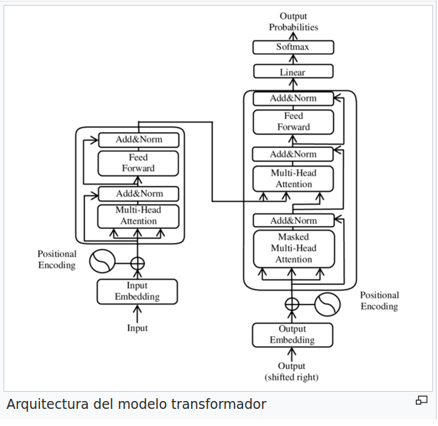

# Transformers
<span style="font-size: 0.8rem; font-style: italic;">Por Victor Padron Garcia y Iván López González</span>

## Que es un transformer
Un Transformer es una arquitectura de red neuronal desarrollada para tareas de procesamiento del lenguaje natural (NLP) y otros problemas secuenciales. Fue presentada inicialmente en el artículo "Attention is All You Need" por Vaswani et al. en 2017. La característica distintiva de los Transformers es el mecanismo de atención, que permite a la red modelar las dependencias a largo plazo entre las palabras en una secuencia.

En un Transformer, la entrada se procesa secuencialmente a través de múltiples capas de codificadores y decodificadores, cada uno de los cuales contiene bloques de atención y redes neuronales feedforward. Durante la atención, el modelo asigna pesos a cada token de entrada basado en su relevancia para otros tokens en la secuencia, permitiendo capturar relaciones a largo plazo y contextuales.

Los Transformers han demostrado un rendimiento excepcional en una variedad de tareas de procesamiento del lenguaje natural, como traducción automática, generación de texto, respuesta a preguntas, y más. Además, se han adaptado a otros dominios, como la visión por computadora, con variantes como los Transformers visionarios (ViT).

A diferencia de las arquitecturas anteriores, como las redes neuronales recurrentes (RNNs) y las redes neuronales convolucionales (CNNs), los transformers no dependen de la recurrencia o de la convolución para capturar la estructura secuencial de los datos de entrada.

En lugar de eso, los transformers utilizan mecanismos de atención para permitir que cada posición en la secuencia de entrada se relacione con todas las demás posiciones, lo que les permite capturar relaciones a largo plazo y dependencias en los datos de entrada de manera más efectiva. 

Esta atención es calculada mediante la ponderación de la importancia relativa de cada elemento en la secuencia para cada otro elemento.Los transformers están compuestos por múltiples capas de unidades llamadas "bloques de atención" (attention blocks).

## Composición
Un bloque de atención en un modelo Transformer generalmente consta de varias capas que trabajan en conjunto para procesar la entrada. A continuación, describiré los componentes típicos de un bloque de atención:

1. **Capa de Auto-atención (Self-Attention):** Esta capa es el corazón del bloque de atención. En la auto-atención, cada palabra en la secuencia de entrada tiene la oportunidad de "atender" a todas las demás palabras en la misma secuencia. Esto se logra calculando los pesos de atención que indican cuánta importancia tiene cada palabra para cada otra palabra en la secuencia. Los pesos de atención se calculan a partir de pares de palabras utilizando operaciones lineales y funciones de activación, como softmax.

2. **Capa de Proyecciones Lineales:** Antes de que se pueda realizar la auto-atención, las representaciones de las palabras de entrada se proyectan en tres espacios de representación distintos: consultas, claves y valores. Estas proyecciones se realizan utilizando transformaciones lineales separadas para cada espacio de representación.

3. **Operaciones de Escalado (Scaling):** Para controlar la magnitud de los gradientes durante el entrenamiento y estabilizar el proceso de auto-atención, los valores de las consultas, claves y valores se escalan dividiéndolos por la raíz cuadrada de la dimensión de las consultas y claves.

4. **Atención Ponderada (Weighted Attention):** Usando las proyecciones de consultas, claves y valores, se calculan los pesos de atención mediante productos escalares entre las consultas y las claves. Estos pesos se normalizan utilizando la función softmax para obtener una distribución de probabilidad sobre las palabras en la secuencia.

5. **Atención Ponderada a los Valores (Weighted Value Attention):** Los pesos de atención obtenidos en el paso anterior se utilizan para ponderar los valores asociados con cada palabra en la secuencia, lo que produce una representación atendida que enfatiza las palabras más relevantes para cada palabra de entrada.

6. **Capa de Concatenación y Proyección Lineal:** Una vez que se han calculado las representaciones atendidas, se concatenan y se proyectan nuevamente en un espacio de representación común mediante transformaciones lineales.

7. **Capa de Normalización por Capas (Layer Normalization):** Después de cada subcapa en el bloque de atención, es común aplicar una capa de normalización por lotes para estabilizar el proceso de entrenamiento y mejorar el flujo de información a través de la red.

8. **Conexiones Residuales y Capa de Alimentación Hacia Adelante (Feedforward Layer):** Finalmente, se agregan conexiones residuales alrededor de cada subcapa del bloque de atención y se aplica una capa de alimentación hacia adelante, que consiste en dos transformaciones lineales separadas por una función de activación, como una función de activación ReLU.

Estos son los componentes principales de un bloque de atención en un modelo Transformer típico. La repetición de múltiples bloques de atención en cascada permite que el modelo capture relaciones complejas y contextuales en los datos de entrada.

## Variantes
Un avance crucial asociado con los transformers es el modelo conocido como "BERT" (Bidirectional Encoder Representations from Transformers), desarrollado por Google en 2018. BERT demostró un rendimiento sobresaliente en una amplia variedad de tareas de NLP, superando a los modelos anteriores gracias a su capacidad para capturar el contexto bidireccional en el texto. Dicho modelo para su pre-entrenamiento utiliza grandes cantidades de texto sin etiquetar, utilizando para su entrenamiento un método de masking, que consiste en enmascarar algunas palabras de los textos y hacer que el modelo prediga lo que pone en ella mediante el contexto circundante. Después del pre-entrenamiento, BERT se puede ajustar para tareas específicas de NLP mediante el entrenamiento adicional con conjuntos de datos etiquetados más pequeños y específicos para la tarea en cuestión.

BERT ha demostrado un rendimiento sobresaliente en una amplia variedad de tareas de NLP y ha sido adoptado ampliamente por la comunidad de investigación y la industria. Su arquitectura y enfoque de pre-entrenamiento y fine-tuning han sentado las bases para muchos desarrollos posteriores en el campo del procesamiento de lenguaje natural.

Han surgido otras numerosas variantes y mejoras de los transformers, incluidos modelos como GPT (Generative Pre-trained Transformer), GPT-2, GPT-3 y otros. Estos modelos pre-entrenados a gran escala han mostrado un rendimiento sorprendente en tareas de generación de lenguaje, traducción automática, comprensión del lenguaje natural, entre otras.

## Usos
Los transformers tienen una amplia variedad de usos prácticos en el campo de la inteligencia artificial y más allá. Algunos de los usos prácticos más destacados incluyen:

1. **Procesamiento de Lenguaje Natural (NLP):** Los transformers han revolucionado el campo del procesamiento del lenguaje natural. Se utilizan en tareas como la traducción automática, la generación de texto, la clasificación de texto, el análisis de sentimientos, la respuesta a preguntas, la síntesis de voz, entre otros.

2. **Búsqueda Semántica:** Los modelos basados en transformers son excelentes para comprender la semántica de las consultas de búsqueda, lo que mejora la precisión y relevancia de los resultados de búsqueda.

3. **Resumen Automático de Texto:** Los transformers son eficaces para identificar las partes más importantes de un texto y generar resúmenes concisos y precisos.

4. **Generación de Texto:** Los modelos como GPT han demostrado ser capaces de generar texto coherente y de alta calidad en una variedad de estilos y tonos.

5. **Diálogo Automático:** Los transformers pueden ser utilizados en sistemas de diálogo automático, como chatbots, asistentes virtuales y sistemas de atención al cliente automatizados.

6. **Análisis de Opiniones:** Los modelos basados en transformers son útiles para analizar grandes volúmenes de opiniones de usuarios en redes sociales, reseñas de productos, etc., para extraer información útil sobre la satisfacción del cliente, tendencias del mercado, etc.

7. **Clasificación de Imágenes y Video:** Aunque los transformers fueron diseñados principalmente para procesar texto, también se pueden adaptar para tareas de visión por computadora, como la clasificación de imágenes y videos, mediante técnicas como la atención visual.

8. **Procesamiento de Datos Biológicos:** Los transformers han demostrado utilidad en el procesamiento de datos biológicos, como la secuenciación del ADN y el modelado de proteínas.

Estos son solo algunos ejemplos de los numerosos usos prácticos de los transformers en una variedad de dominios. Su capacidad para capturar relaciones complejas y contextuales en los datos de entrada los hace extremadamente versátiles y poderosos para una amplia gama de aplicaciones en la inteligencia artificial.

## Arquitectura de un transformer
<figure markdown="span">
    
<figure>

## Ejemplo básico de un transformer(se puede ejecutar direcctamente en collab)
```py
    import tensorflow as tf
from tensorflow import keras
from tensorflow.keras import layers


# Capa de atención multi-cabeza
class MultiHeadSelfAttention(layers.Layer):
   def __init__(self, embed_dim, num_heads):
       super(MultiHeadSelfAttention, self).__init__()
       self.embed_dim = embed_dim
       self.num_heads = num_heads
       assert embed_dim % num_heads == 0
       self.projection_dim = embed_dim // num_heads
       self.query_dense = layers.Dense(embed_dim)
       self.key_dense = layers.Dense(embed_dim)
       self.value_dense = layers.Dense(embed_dim)
       self.combine_heads = layers.Dense(embed_dim)

   def attention(self, query, key, value):
       score = tf.matmul(query, key, transpose_b=True)
       dim_key = tf.cast(tf.shape(key)[-1], tf.float32)
       scaled_score = score / tf.math.sqrt(dim_key)
       weights = tf.nn.softmax(scaled_score, axis=-1)
       output = tf.matmul(weights, value)
       return output, weights

   def separate_heads(self, x, batch_size):
       x = tf.reshape(x, (batch_size, -1, self.num_heads, self.projection_dim))
       return tf.transpose(x, perm=[0, 2, 1, 3])

   def call(self, inputs):
       # Obtener dimensiones de entrada
       batch_size = tf.shape(inputs)[0]
       query = self.query_dense(inputs)  # (batch_size, seq_len, embed_dim)
       key = self.key_dense(inputs)  # (batch_size, seq_len, embed_dim)
       value = self.value_dense(inputs)  # (batch_size, seq_len, embed_dim)
       # Dividir en múltiples cabezas
       query = self.separate_heads(query, batch_size)  # (batch_size, num_heads, seq_len, projection_dim)
       key = self.separate_heads(key, batch_size)  # (batch_size, num_heads, seq_len, projection_dim)
       value = self.separate_heads(value, batch_size)  # (batch_size, num_heads, seq_len, projection_dim)
       # Calcular atención
       attention, weights = self.attention(query, key, value)
       # Unir cabezas
       attention = tf.transpose(attention, perm=[0, 2, 1, 3])  # (batch_size, seq_len, num_heads, projection_dim)
       concat_attention = tf.reshape(attention, (batch_size, -1, self.embed_dim))  # (batch_size, seq_len, embed_dim)
       output = self.combine_heads(concat_attention)  # (batch_size, seq_len, embed_dim)
       return output, weights

# Capa de feedforward
class FeedForwardNetwork(layers.Layer):
   def __init__(self, embed_dim, ff_dim):
       super(FeedForwardNetwork, self).__init__()
       self.dense1 = layers.Dense(ff_dim, activation='relu')
       self.dense2 = layers.Dense(embed_dim)

   def call(self, inputs):
       x = self.dense1(inputs)
       x = self.dense2(x)
       return x

# Bloque de atención
class TransformerBlock(layers.Layer):
   def __init__(self, embed_dim, num_heads, ff_dim, rate=0.1):
       super(TransformerBlock, self).__init__()
       self.att = MultiHeadSelfAttention(embed_dim, num_heads)
       self.ffn = FeedForwardNetwork(embed_dim, ff_dim)
       self.layernorm1 = layers.LayerNormalization(epsilon=1e-6)
       self.layernorm2 = layers.LayerNormalization(epsilon=1e-6)
       self.dropout1 = layers.Dropout(rate)
       self.dropout2 = layers.Dropout(rate)

   def call(self, inputs, training):
       attn_output, _ = self.att(inputs)
       attn_output = self.dropout1(attn_output, training=training)
       out1 = self.layernorm1(inputs + attn_output)
       ffn_output = self.ffn(out1)
       ffn_output = self.dropout2(ffn_output, training=training)
       return self.layernorm2(out1 + ffn_output)

# Modelo de transformer
class Transformer(keras.Model):
   def __init__(self, num_layers, embed_dim, num_heads, ff_dim, input_vocab_size, target_vocab_size, max_len, rate=0.1):
       super(Transformer, self).__init__()
       self.token_embedding = layers.Embedding(input_vocab_size, embed_dim)
       self.pos_encoding = layers.Embedding(max_len, embed_dim)
       self.transformer_blocks = [TransformerBlock(embed_dim, num_heads, ff_dim, rate) for _ in range(num_layers)]
       self.dropout = layers.Dropout(rate)
       self.final_layer = layers.Dense(target_vocab_size)

   def call(self, inputs, training):
       seq_len = tf.shape(inputs)[1]
       positions = tf.range(start=0, limit=seq_len, delta=1)
       position_embeddings = self.pos_encoding(positions)
       x = self.token_embedding(inputs)
       x += position_embeddings
       x = self.dropout(x, training=training)
       for transformer_block in self.transformer_blocks:
           x = transformer_block(x, training)
       output = self.final_layer(x)
       return output
```

### Codigo para ejecutarlo:
```py
import numpy as np

# Datos de ejemplo
input_vocab_size = 10000
target_vocab_size = 5000
max_len = 100
num_samples = 1000

inputs = np.random.randint(0, input_vocab_size, size=(num_samples, max_len))
targets = np.random.randint(0, target_vocab_size, size=(num_samples, max_len))

# Parámetros del modelo
num_layers = 4
embed_dim = 128
num_heads = 8
ff_dim = 512

# Crear instancia del modelo
transformer = Transformer(num_layers, embed_dim, num_heads, ff_dim, input_vocab_size, target_vocab_size, max_len)

# Compilar el modelo
transformer.compile(optimizer='adam', loss='sparse_categorical_crossentropy')

# Entrenar el modelo
transformer.fit(inputs, targets, batch_size=64, epochs=10, validation_split=0.2)

# Evaluar el modelo
loss = transformer.evaluate(inputs, targets)
print("Loss:", loss)
```