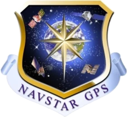
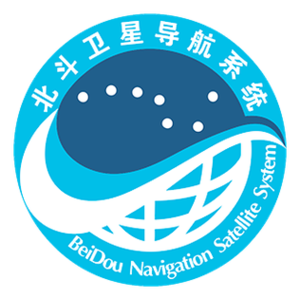
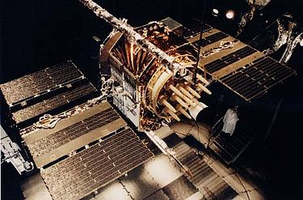
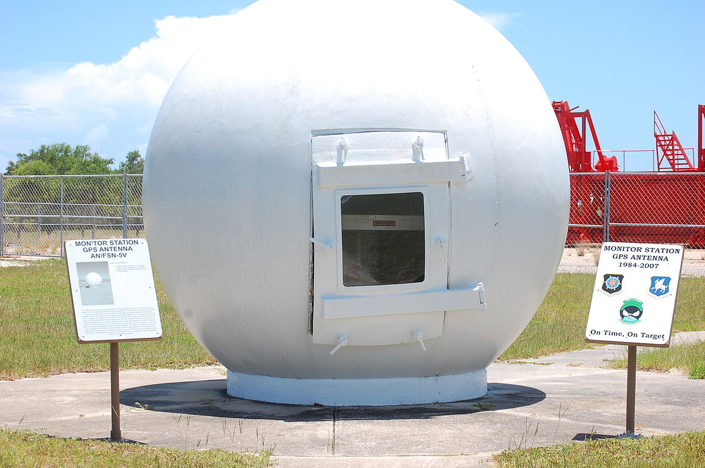
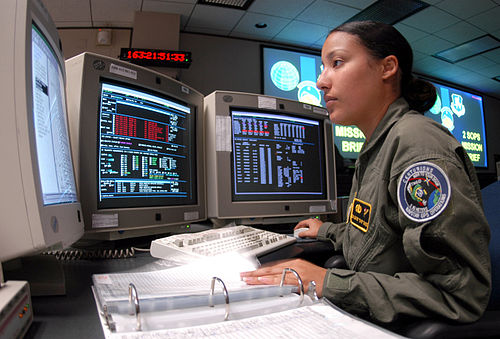
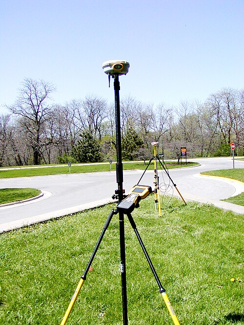
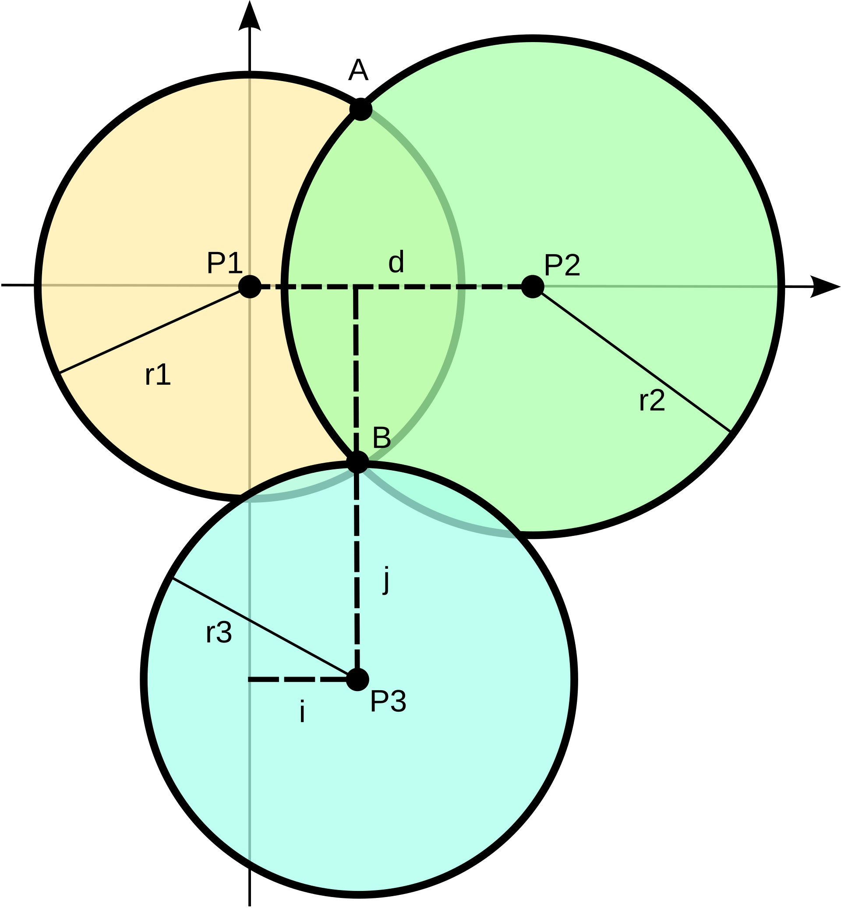
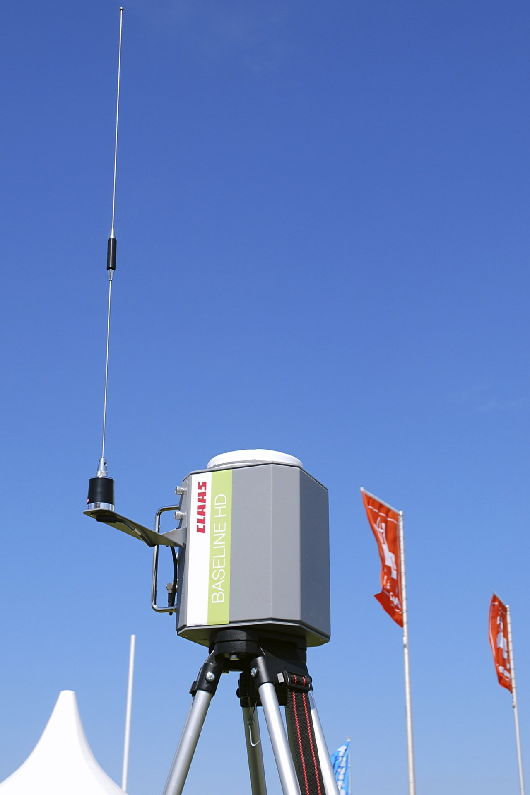

# GPS & GeoFencing
Por Álvaro Martínez Sánchez


## 1 Qué es el GPS
El GPS o Sistema de Posicionamiento Global es el sistema que se utiliza a día de hoy en multitud de aplicaciones y dispositivos electrónicos con el fin de ubicarse a sí mismos alrededor de todo el globo terráqueo. Está presente tanto en uso civil como en uso militar, y es una tecnología que puede ofrecer gran precisión dependiendo de cómo se use.


## 2 Historia del GPS
Antes del GPS existieron diferentes sistemas de localización:


- **Sistema de navegación terrestre [`Omega`] (1960)**: Fue el primer sistema de navegación mundial basado en pares de estaciones terrestres.


- **Sistema [`TRANSIT`] (1964 - 1967)**: Puesta en uso de la tecnología del sistema Omega por la armada estadounidense. Primer sistema basado en una constelación de 6 satélites en órbita baja.


En 1967, se desarrolló el satélite [`Timation`], que demostró que era posible colocar relojes precisos en el espacio, y que haría posible el desarrollo del GPS.


El desarrollo del GPS como lo conocemos en la actualidad comienza en 1973, con esfuerzos conjuntos de la armada y la fuerza aérea de EEUU, con la creación de un programa llamado "Navigation Technology Program", que más tarde sería renombrado a NAVSTAR GPS, dando lugar al GPS que conocemos en la actualidad.
No sería hasta 1993 que la constelación actual estaría completa, y hasta 1995 que se pondría a disposición de uso civil.


## 3 Variantes del GPS
No solamente existe el GPS, distintas regiones también han desarrollado variantes. Estas son todas las variantes de GPS actualmente en uso y sus creadores:


- [`GPS`]: Creado por Estados Unidos
- [`GLONASS`]: Creado por la Unión Soviética
- [`Galileo`]: Creado por la Unión Europea
- [`Beidou`]: Creado por China








## 4 Funcionamiento del GPS
El sistema GPS se compone de tres partes, que veremos a continuación


### 4.1 Satélites
Son los encargados de recibir las conexiones de los receptores. Se organizan en grupos llamados constelaciones y se encargan de emitir señales de radio que los receptores usan para determinar su ubicación.





### 4.2 Estaciones Terrestres
Son los puntos de monitorización de los satélites. Localizan de manera precisa la ubicación de los satélites usando radar, y predicen la posición en las horas próximas, haciendo correcciones en caso de ser necesario.






### 4.3 Receptores
Son los encargados de procesar las señales GPS y determinar su propia ubicación. Existen receptores militares, profesionales y civiles, que proporcionan diferentes precisiones de posicionamiento:


- Receptores militares: precisión submétrica (<1 metro).
- Receptores profesionales: precisión centimétrica.
- Receptores civiles: la precisión oscila entre 3 y 5 metros.





### 4.4 [`Trilateración`]
La localización por GPS se lleva a cabo a partir de **trilateración**. La trilateración es un método matemático que permite la localización de objetos en un plano bidimensional utilizando normalmente 3 puntos de referencia, mediante teoría de ángulos.





### 4.5 [`GPS diferencial`]
A pesar de que la trilateración solamente requiere de 3 satélites, el GPS realmente requiere 4, ya que no nos encontramos en un plano bidimensional, y se debe conocer la profundidad para determinar la posición correctamente.


Dicha profundidad se calcula usando tiempos de llegada de la señal de radio desde el GPS hasta el receptor, pero hay que tener en cuenta que puede haber un factor error en la señal debido a condiciones meteorológicas.


El GPS Diferencial(o DGPS) es un mecanismo que existe para corregir dichos errores en la señal GPS.
Consiste en utilizar estaciones de referencia en localizaciones conocidas para corregir el posible error de la señal recibida.


Para ello, la estación hace uso del GPS para localizarse a sí misma y aplica correcciones a la posición recibida, para que coincida con la posición real. Los valores de corrección aplicados por la estación son usados por los receptores GPS para obtener una ubicación más precisa.





## 5 GeoFencing
El geofencing es una técnica que consiste en crear un recinto virtual en el mapa. Se suele utilizar para tomar acciones una vez un GPS entra o sale de la misma.


Existen tres tipos de geofencing:
- Geofencing estático: La zona delimitada en el mapa es siempre la misma
- Geofencing dinámico: La zona delimitada en el mapa no se mantiene en el mismo lugar, se mueve.
- Geofencing híbrido: Se combina el GPS con otros sensores para obtener información más precisa en un recinto. Un ejemplo es el uso de balizas bluetooth.


## 6 Uso en dispositivos móviles
Vamos a ver como implementar geofencing en flutter:
<br>


, para añadiremos el paquete [`geofence_foreground_service`] al archivo pubspec.yaml(archivo de dependencias de dart):
```yaml
dependencies:
 geofence_foreground_service: ^1.1.5
```


**IMPORTANTE: geofence_foreground_service requiere de habilitar MultiDex, que puede ser hecho [`aqui`](https://docs.flutter.dev/deployment/android#enable-multidex-support)**


Ahora activamos que nuestra aplicación se ejecute en segundo plano en el `AndroidManifest.xml`:
```xml
<service
   android:name="com.f2fk.geofence_foreground_service.GeofenceForegroundService"
   android:foregroundServiceType="location">
</service>
```


Ahora añadimos permisos de ubicación:
```xml
<!--required-->
<uses-permission android:name="android.permission.FOREGROUND_SERVICE_LOCATION" />


<!--at least one of the follwoing-->
<uses-permission android:name="android.permission.ACCESS_FINE_LOCATION" />
<uses-permission android:name="android.permission.ACCESS_COARSE_LOCATION" />
```


Y ya podemos comenzar. Comenzamos definiendo el callback que se llamará cuando se de un evento en el área del geofencing (entrada, salida, ...) en el archivo `main.dart`:
```dart
import 'package:geofence_foreground_service/exports.dart';
import 'package:geofence_foreground_service/geofence_foreground_service.dart';
import 'package:geofence_foreground_service/models/zone.dart';


@pragma('vm:entry-point') // Esto le dice a la dart VM que es un punto de entrada ademas de main
void callbackDispatcher() async {
   // Este método se llamará cuando las zonas definidas reciban un evento, el log se mostrará por la consola debug
 GeofenceForegroundService().handleTrigger(
   backgroundTriggerHandler: (zoneID, triggerType) {
     log(zoneID, name: 'zoneID');


     if (triggerType == GeofenceEventType.enter) {
       log('enter', name: 'triggerType');
     } else if (triggerType == GeofenceEventType.exit) {
       log('exit', name: 'triggerType');
     } else if (triggerType == GeofenceEventType.dwell) {
       log('dwell', name: 'triggerType');
     } else {
       log('unknown', name: 'triggerType');
     }


     return Future.value(true);
   },
 );
}
```


Ahora podemos continuar y definir nuestro widget de entrada como en una aplicación de dart común y corriente:
```dart
Future<void> main() async {
 WidgetsFlutterBinding.ensureInitialized();


 runApp(const MyApp());
}


// En flutter existen 2 tipos principales de widgets, StatelessWidget y StatefulWidget. La diferencia es si el estado
// de la clase tiene que poder mutar. En nuestro caso activamos el geofencing con un botón, lo que hace que el estado
// tenga que ser dinámico, por ello se usa StatefulWidget
class MyApp extends StatefulWidget {
 const MyApp({super.key});


 @override
 State<MyApp> createState() => _MyAppState();
}


class _MyAppState extends State<MyApp> {
 static final List<LatLng> _squarePolygon = [
   LatLng.degree(x1, y1),
   LatLng.degree(x2, y2),
   LatLng.degree(x3, y3),
   LatLng.degree(x4, y4),
 ];


 bool _hasServiceStarted = false;


 @override
 void initState() {
   super.initState();
   initPlatformState();
 }


 // Platform messages are asynchronous, so we initialize in an async method.
 Future<void> initPlatformState() async {
   await Permission.location.request();
   await Permission.locationAlways.request();
   await Permission.notification.request();


   _hasServiceStarted =
       await GeofenceForegroundService().startGeofencingService(
     contentTitle: 'Test app is running in the background',
     contentText:
         'Test app will be running to ensure seamless integration with ops team',
     notificationChannelId: 'com.app.geofencing_notifications_channel',
     serviceId: 525600,
     isInDebugMode: true,
     notificationIconData: const NotificationIconData(
       resType: ResourceType.mipmap,
       resPrefix: ResourcePrefix.ic,
       name: 'launcher',
     ),
     callbackDispatcher: callbackDispatcher,
   );


   log(_hasServiceStarted.toString(), name: 'hasServiceStarted');
 }


 Future<void> _createSquarePolygonGeofence() async {
   if (!_hasServiceStarted) {
     log('Service has not started yet', name: 'createGeofence');
     return;
   }


   await GeofenceForegroundService().addGeofenceZone(
     zone: Zone(
       id: 'zone#1_id',
       radius: 10000, // measured in meters
       coordinates: _squarePolygon,
     ),
   );
 }


 @override
 Widget build(BuildContext context) {
   return MaterialApp(
     home: Scaffold(
       appBar: AppBar(
         title: const Text('Plugin example app'),
       ),
       body: Center(
         child: Column(
           mainAxisAlignment: MainAxisAlignment.center,
           children: [
             ElevatedButton(
                 onPressed: _createSquarePolygonGeofence,
                 child: const Text('Create Polygon Times Square Geofence')),
           ],
         ),
       ),
     ),
   );
 }
}
```


## Referencias


- Sistema de navegación terrestre [`Omega`] – Blog Aviónica Joglar  
- Sistema [`TRANSIT`] – Wikipedia  
- Satélite [`Timation`] – Wikipedia  
- [`GPS`] – Wikipedia  
- [`GLONASS`] – Wikipedia  
- [`Galileo`] – Wikipedia  
- [`Beidou`] – Wikipedia  
- [`Trilateración`] – Wikipedia  
- [`GPS diferencial`] – Wikipedia  
- Paquete [`geofence_foreground_service`] – pub.dev


[`Omega`]: https://avionicajoglar.blogspot.com/2017/10/el-sistema-de-navegacion-omega.html
[`TRANSIT`]: https://es.wikipedia.org/wiki/Transit_(sat%C3%A9lite)
[`Timation`]: https://es.wikipedia.org/wiki/Timation
[`GPS`]: https://es.wikipedia.org/wiki/GPS
[`GLONASS`]: https://es.wikipedia.org/wiki/GLONASS
[`Galileo`]: https://es.wikipedia.org/wiki/Galileo_(navegaci%C3%B3n_por_sat%C3%A9lite)
[`Beidou`]: https://es.wikipedia.org/wiki/Beidou
[`Trilateración`]: https://es.wikipedia.org/wiki/Trilateraci%C3%B3n
[`GPS diferencial`]: https://es.wikipedia.org/wiki/GPS_diferencial
[`geofence_foreground_service`]: https://pub.dev/packages/geofence_foreground_service


