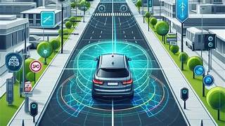
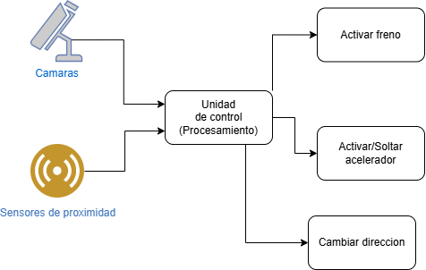
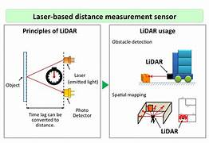
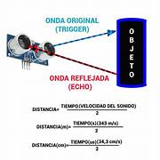

# Conducción autonóma

Por *Aida Villalba Ferrández*

# 1. Introducción
## 1. ¿Qué es la conducción autónoma y cómo funciona?
La conducción autónoma es la capacidad de un vehículo para percibir y analizar su entorno, tomar decisiones siguiendo las reglas programadas y ejecutar maniobras con la mínima 	intervención humana posible.

Mediante cámaras, radares y otros sensores, el vehículo capta lo que ocurre a su alrededor. A continuación la información capturada es procesada por una unidad de control que calcula 	la mejor maniobra y la 	aplica a la dirección, los frenos o la aceleración.

## 2. Historia y evolución
La teorías para desarrollar vehículos autónomos comenzaron a desarrollarse a mediados del siglo XX. Estas teorías se basaban en el uso de sensores que permitieran al vehículo percibir 	su entorno y tomar decisiones en base a lo que observaba.

En la década de 1980, se llevaron a cabo los primeros experimentos significativos, con prototipos que utilizaban cámaras y radares para detectar obstáculos y seguir caminos.

Posteriormente, la llegada de la inteligencia artificial permitió a los vehículos procesar grandes cantidades de datos en tiempo real,lo que disminuyó el tiempo de reacción.

A partir de 2010, la incorporación de sensores LIDAR y cámaras de alta resolución ha mejorado significativamente la percepción del entorno por parte de los vehículos.
## 3. Niveles de autonomía
Existen un total de 6 niveles de autonomía clasificados del 0 al 5,siendo el 0 el más dependiente de intervención humana y el 5 el más autónomo.

1.**Nivel 0**:No existe ningún tipo de automatización en el vehículo. Pertenecen a este nivel los coches fabricados antes de la década de los 90.
2.**Nivel 1**:Se incorpora algo de asistencia por parte del coche para reducir el número de tareas a realizar por parte del conductor. 
Algunas de las asistencias ofrecidas son:

* Control de velocidad
* Mantenimiento de carril
* Ayuda al aparcamiento 
* Aviso de colisión y peatones con función de frenado en ciudad 

**Limitaciones**:El coche no puede controlar a la vez movimientos longitudinales (|) y laterales(-).

3.**Nivel 2**:El coche ya puede controlar simultáneamente movimientos longitudinales (|) y laterales (-) y es capaz de acelerar o frenar manteniendo la distancia con el coche de 	delante y manteniéndose en el carril.
	Algunas de las asistencias ofrecidas son:
* Ayuda al aparcamiento sin que el conductor toque el volante
* Asistente de conducción para reducir el estrés en los atascos	

4.**Nivel 3**:El coche ya es capaz de encargarse prácticamente de toda la conducción,ve lo que tiene en su entorno y puede actuar en función de los elementos que le rodean. 
Por lo tanto, el conductor ya puede soltar el volante y los pedales para que el coche *"se lleve él solo"*.

**Limitaciones**:se requiere la supervisión de un humano por si el software no responde adecuadamente

5.**Nivel 4**:El coche es totalmente capaz de conducir por sí solo, sin actuación humana. Si el humano solicita que se le ceda el control, el coche puede decidir si dárselo 	inmediatamente 	o esperar hasta que la cesión del manejo sea la idónea por seguridad.

En caso de condiciones meteorológicas adversas,el vehículo tiene establecidos los protocolos necesarios para evitar el peligro por sí solo hasta ponerse a salvo.

6.**Nivel 5**:Automatización total.Son vehículos sin volante, ni pedales porque ellos mismos se controlan sin necesidad de que una persona actúe en ningún momento.

# 2. Sensores utilizados
## 1. Lidar
Es una tecnología de teledetección que utiliza rayos láser para medir distancias y movimientos precisos en tiempo real.

**Usos:**

* Generar mapas topográficos
* Generar modelos 3D precisos
* Evaluar riesgos y catástrofes naturales

**Funcionamiento**
El sensor emite un pulso de luz láser (generalmente infrarrojo) que viaja a la velocidad de la luz. Cuando el pulso impacta una superficie, parte de la energía se refleja de vuelta 	al sensor. A partir del tiempo que tarda en regresar la energía se calcula la distancia a la que se encuentra la superficie impactada,aplicando la siguiente fórmula:
**$d = \frac {c × t} {2}$** donde c es la velocidad de la luz y t es el tiempo transcurrido. Repitiendo el proceso y expandiéndolo a un área mayor se obtiene la ***nube de puntos 	lidar***.

**Componentes**
* Escáner emisor de luz
* Sensor detector del impacto de la energía
* Procesador que calcula el tiempo y mide la distancia

**Limitaciones**:

-Sufre en situaciones de climatología adversa  
-Coste elevado

**Rango de detección**: Suele situarse entre 30 y 200 metros,aunque algunos pueden superar los 300 metros.
## 2. Radar
Se basa en la transmisión y reflexión de ondas electromagnéticas. Cuando se emite la onda esta se refleja en la superficie impactada y regresa de vuelta al sensor, lo que permite medir con exactitud distancias, niveles de llenado o posiciones.

Este tipo de sensor es especialmente resistente a condiciones climáticas extremas como lluvia,temperaturas extremas,nieve, polvo o bajos niveles de luz.Además,son mucho más rápidos que muchos otros tipos de sensores.

## 3. Cámaras y visión artificial
* **Función:**  Su principal función es identificar señales de tráfico, peatones y otros vehículos mediante la captura de imágenes 2D y el posterior procesamiento a través de algoritmos de ***Deep Learning***.
* **Ventajas:** Los algoritmos de IA no solo son capaces de procesar las imágenes capturadas sino que también pueden predecir el tráfico de las carreteras basándose en datos reales.
* **Limitaciones:** El mayor problema es que pueden sufrir problemas cuando se exponen a contraluces extremos, deslumbramientos, o en condiciones de lluvia intensa o marcas viales poco visibles.

En comparación con el sensor LIDAR, este también puede sufrir en condiciones climatológicas extremas, sin embargo es capaz de obtener mapas 3D,mientras que las cámaras solo pueden proporcionar imágenes 2D.

* **Principales modelos de IA usados:** Los niveles de automatización 1 y 2  usan modelos basados en reglas,los niveles 3 y 4 emplean ***Deep Learning*** y aprendizaje por refuerzo.Por último el nivel más avanzado, el 5,se basan en aprendizaje multiagente (las acciones de un agente cambian las condiciones para los demás) e IA explicable (justifica las decisiones que toma).

## 4. Ultrasonidos
Es un sensor que sirve para detectar la distancia de un objeto a través de ondas de sonido con frecuencias por encima de los 20Khz.

Su funcionamiento es muy similar al del resto de sensores utilizados para calcular distancia:emite una señal de sonido hacia algún lugar en concreto y espera a que esta señal rebote en algún objeto y vuelva al sensor. Para saber a que distancia se encuentra el objeto el sensor mide el tiempo transcurrido desde que se emitió la señal hasta que regresó y a través de cálculos matemáticos traduce este tiempo en distancia.

## 5. GPS y localización
Es un dispositivo electrónico que recibe señales de los satélites del Sistema de Posicionamiento Global (GPS) y las utiliza para calcular su propia ubicación tridimensional (latitud, longitud y altitud), así como su velocidad y la hora.

**Funcionamiento**:  

1.El sensor GPS recibe señales de varios satélites GPS visibles.

2.A partir de las señales recibidas de los diferentes satélites calcula la distancia a cada uno de ellos y posteriormente triangula la posición del receptor.

3.Aplicando algoritmos matemáticos obtiene las coordenadas (latitud, longitud y altitud).

4.También es posible calcular la velocidad y hora a través de las mismas señales recibidas.
# 3. Procesamiento con IA
En el contexto de la conducción autonóma,se utilizan algoritmos de ***Machine Learning y Deep Learning*** para procesar la información recopilada por cada uno de los sensores del vehículo y tomar decisiones en tiempo real.
Este procesamiento nos permite obtener el **ángulo de giro** así como la **velocidad a aplicar**.

Además,también permite al vehículo saber si esta o no **dentro del carril**,un analisis que puede complicarse cuando dos carriles se encuentran muy cercanos o no se distingue bien la línea separatoria entre ellos. 
## 1. Redes neuronales
### 1.1 Elección de datasets
Dadas las dificultades reales que pueden surgir durante el proceso de conducción, la red debe ser entrenada con un conjunto diverso de datos de entrada que incluya:  

* Imágenes difusas o donde no se aprecie bien los símbolos de las señales,las líneas del carril 
* Estados de tráfico diversos
* Diferentes situaciones meteorológicas 

Para que la red este lo más entrenada posible se necesitarían millones de imágenes preferiblemente de alta calidad, teniendo en cuenta que la recopilación de todo este conjunto de imágenes sería muy costoso, la mejor opción es obtener parte de estos datos de forma sintética, a partir de simuladores, y combinarlos con algunos datos reales.
### 1.2 Técnicas de preprocesamiento
En este caso el preprocesamiento es necesario para asegurar que las imágenes que recibe la red tienen la mejor calidad posible.Algunas de las modificaciones a aplicar al conjunto de datos con el fin de conseguir una mejor calidad y eliminar el ruido son:

* **Cambio de tamaño:**   
Es necesario aplicar esta técnica ya que las redes esperan un tamaño de imagen concreto predefinido en la capa de entrada y todos los datos de entrada deben cumplir con esas dimensiones. 
* **Normalización de los datos:**   
Dado que las fuentes de los datos son muy diversas es necesario definir un rango estándar y normalizar todos los datos de acuerdo a ese rango. Este algoritmo es conocido como **normalizacion Min-Max** y emplea la siguiente fórmula **$x'=\frac {x-x_{min}} {x_{max}-x_{min}}$**.  
Otra técnica para normalizar es la estandarización o **normalización *z-score*** que consiste en comparar los valores de los datos con la media de todos ellos,asignando valores positivos a los datos que se encuentran por encima de la media y valores negativos a los datos que se encuentran por debajo.
La fórmula a aplicar es la siguiente: **$z'=\frac {x-\mu} {\sigma}$**
* **Data augmentation**: Esta técnica consiste en aumentar el conjunto de datos de entrada generando nuevas imagénes mediante la aplicación de transformaciones a las imágenes originales.Dichas transformaciones pueden ser **rotaciones, cambios de escala o de iluminación** .Esto permite además conseguir un modelo invariante a escala,rotaciones y cambios de iluminación.

### 1.3 Redes convolucionales (CNN)
Suelen utilizarse para detectar y clasificar características específicas de la imagen, como bordes y formas.Y posteriormente,utilizar esta información para identificar objetos y ubicarlos en la imagen.
Se componen de:  
**1.Capas de convolución:** utilizadas para extraer características a diferentes niveles de abstracción (características más generales en las primeras capas y más específicas en las capas posteriores).
Cada capa de convolución va acompañada por una ***capa de pooling*** que reduce el tamaño de la salida antes de pasarlo a la siguiente capa. La capa de pooling más utilizada es ***MaxPooling***.  
**2.Capas dense (Fully Conected):** se utilizan para la clasificación final,especificación.   
**3.Capa de salida:** Produce las salidas finales de la red, representando las probabilidades de clasificación de diferentes clases de objetos.

### 1.4 Transformers
En el contexto de la conducción autonóma son utilizados para comprender relaciones complejas entre los elementos de la imagen gracias a su mecanismo de atención.  
Son la base de los algoritmos del sistema de percepción.Dichos algoritmos se encargan de rastrear cada objeto (tanto otros vehículos como peatones),determinar cómo, en qué dirección y a qué velocidad se mueve, y predecir hacia dónde se moverá a continuación en función de sus acciones pasadas.  
Una vez analizadas las posibles situaciones futuras, el sistema de planificación decide cuál es la mejor manera de moverse de forma segura y envía órdenes a los sistemas de control del vehículo (dirección, motor, cambio, frenos, señalización…) para que circule.   
Este sistema también elige en qué carril debe circular el vehículo, a qué velocidad, cuándo debe girar, acelerar o frenar o en qué momento debe detenerse.

## 2. Procesamiento de imágenes en tiempo real
Obviamente en el contexto de la conducción autonóma se busca la mínima latencia,ya que unos segundos de más pueden resultar en un accidente grave.
Para conseguir esto,es necesario utilizar tarjetas gráficas dedicadas,como las GPUs de NVIDIA.
Este procesamiento consta de 2 fases principales y una opcional:

**Fases principales**:

* **Detección de los objetos**:Marcar la ubicación de cada posible objeto
* **Clasificación**:Separar los objetos detectados en grupos según sus características
* **Fase opcional**:Predicción de acciones futuras (p.e que un peatón cruce)

### 2.1 Softwares más utilizados
* **Hydranet**:Tesla
* **Apollo**:Baidu, de codigo abierto
* **OpenCV**:Solo para el preprocesamiento

## 3. Mapas HD
**Incluyen**:Características básicas de la carretera (intersecciones y señales de tráfico) + detalles de la superficie de la carretera ( bordes, cambios de elevación,líneas de carril y otros elementos dinámicos).  
**Mapa convencional vs Mapa HD**:El mapa convencional proporciona una visión general de la red vial, mientras que el mapa HD está diseñado para proporcionar datos de precisión centimétrica, lo que permite a los vehículos conocer su posición exacta con una exactitud de pocos centímetros.Además,esta técnica de mapeo proporciona actualización de los mapas en tiempo real.Para ello se basan tanto en la información recibida de los sensores como de la obtenida con comunicaciones **V2I**.

# 4. Comunicaciones
Las tecnologías V2X combinan la comunicación dedicada de corto alcance (DSRC) y la tecnología C-V2X.  
**DSRC**:

* Corto alcance 
* Baja latencia de hasta 1000 metros
* Clave para funciones de seguridad como las advertencias de colisión.
* Recomendado para espacios reducidos (tiene menor alcance).

**C-V2X**:

* Utiliza 5G para una mayor cobertura y un mayor ancho de banda. 
* Funciona con las redes móviles actuales.
* Recomendado para obtener datos rápidos como mapas HD
## 1. V2V(Vehículo a vehículo)
Se trata de un sistema inteligente que permite a los vehículos intercambiar información de forma inalámbrica en tiempo real sobre su posición, velocidad y dirección.

**Tecnologías integradas**:

 * Advertencia de colisión frontal
 * Detección electrónica de freno de emergencia
 * Advertencia de no adelantamiento
 * Asistencia de giro a la izquierda
 * Asistencia de movimiento en intersección
 * Advertencia de punto ciego/advertencia de cambio de carril 

 **Limitaciones**:Requiere de la coordinación de todos los vehículos en la carretera.

## 2. V2I(Vehículo a infraestructura)
Es un sistema de comunicación entre los coches y la infraestructura que los rodea (señales de tráfico, semáforos e incluso la propia red de carreteras).  
Permite conocer en tiempo real y de forma exacta el estado e incidencia del tráfico y la ubicación y dirección de los vehículos que circulan por las vías.  
Requiere de ***unidades de Carretera (RSUs)*** y ***unidades a Bordo (OBUs)***.

* **RSUs**:colocadas estratégicamente a lo largo de las carreteras, actúan como la interfaz principal entre los vehículos y la infraestructura de transporte, retransmitiendo información sobre condiciones de tráfico, zonas en obras y más.
* **OBUs:** Instaladas en vehículos, reciben datos de las RSUs y otros elementos de la infraestructura, permitiendo a los vehículos tomar decisiones informadas basadas en las condiciones de tráfico y el estado de la carretera en tiempo real.

# 5. Seguridad y fiabilidad 
## 1. Casos de fallos
* **Fallos en la clasificación de objetos**: Uber, (2018,Arizona)  
El sistema detectó un objeto e intentó clasificarlo por 3 veces, de forma que cuando llegó a la clasificación correcta ya no habia tiempo para frenar y el fallo fue mortal.
* **Fallos al interpretar la señalización:**
Frente a lineas de carril poco claras o semáforos apagados debido a fallos eléctricos algunos vehículos han quedado bloqueados al no saber como reaccionar.
* **Perdida de conectividad:** San Francisco,bloqueo a vehículos de emergencia
* **Fallos humanos (exceso de confianza):** (Seatle,2024)
Un Tesla en modo FSD atropelló a un motociclista mientras el conductor miraba su móvil.

## 2. Redundancia de sistemas
 Dada la imposibilidad de asegurar el funcionamiento sin fallos, es necesario desarrollar varios niveles de redundancia en todos los sistemas de control del vehículo críticos para la seguridad,es decir evitar el punto de fallo único (SPOF).
 Los sistemas redundantes deben cumplir lo siguiente:
 * Deben tener fuentes de alimentación separadas
 * No sobra con duplicar el sensor,hay que combinar sensores para suplir con unos las carencias o limitaciones de otros.
 * El sistema debe ser capaz de **detectar el fallo** pero seguir trabajando a pesar de este, es decir, debe ser **tolerante al fallo**.
 * Cuando un sistema falla, el vehículo no se detiene en seco: entra en un modo degradado planificado.
 * No solo los sensores y actuadores deben duplicarse, también los buses de datos.

# 6. Empresas y estado actual
En Estados Unidos ya circulan algunos vehículos de nivel 4 en áreas restringuidas y para servicios concretos,como taxis.  
China por su parte esta probando el funcionamiento de ese mismo nivel en zonas con tráfico denso,obteniendo de momento resultados positivos.  
En Europa, el avance es más lento y de momento el máximo nivel de autonomía de coches en circulación es el 2,es decir,con coches algunas asistencias,pero donde el conductor todavía juega un papel esencial y debe estar muy atento.  
Algunas de las **empresas más conocidas** son:
* Tesla
* Waymo (Google)
* Aurora (Uber)
* Cruise (General Motors)
* Mobileye (Intel) 
* Baidu (China,taxis autónomos)

