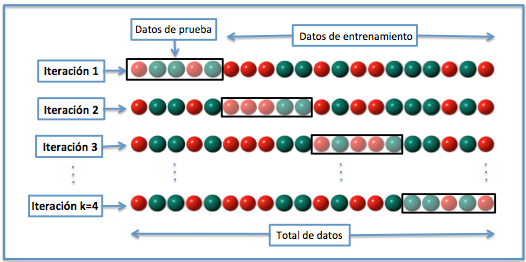
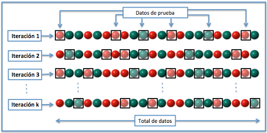

# Validación

_Redactado por: Julio Corbalán Moreno_

La validación es la parte del entrenamiento de una red neuronal en la que comprobamos la capacidad del modelo de predecir resultados en función de los valores de entrada. Existen varios tipos de validación.

## Validación externa o método de retención

La validación extrerna es una forma de validación de un modelo en la que el conjunto de datos que disponemos se divide en un grupo, el conjunto de entrenamiento, que se utiliza para entrenar el modelo, y el conjunto de prueba (o test), con el que comprobamos la efectividad del modelo.

Adicionalmente, se puede disponer de un tercer conjunto, llamado conjunto de validación, que se utiliza durante la fase de entrenamiento para ajustar los hiperparámetros.

## Validación cruzada

La validación cruzada (_cross-validation_ en inglés) engloba a un conjunto de técnicas similares para la validación de modelos, en la que se utiliza todo el conjunto de datos para entrenar y validar el modelo.

En lugar de dividir los datos en un conjunto de entrenamiento y un conjunto de prueba, como se realiza normalmente, mediante la validación cruzada se segmenta el conjunto de datos en diferentes particiones o pliegues (_folds_ en inglés) y se calcula la media aritmética del entrenamiento y validación sobre cada una de ellas.

De esta forma, nos protejemos de la variación que induce la división entre los datos de entrenamiento y los datos de prueba, a coste de un mañor coste computacional (Linear respecto al número de iteraciones). También ayuda a proteger el modelo de un sobreajuste cuando los datos de entrenamiento son reducidos o el modelo posee un gran número de parámetros.

Es una técnica importante para evaluar y comparar modelos de aprendizaje automático de manera más precisa y confiable, proporcionando una estimación más realista de su rendimiento en datos no vistos.

### Tipos de validación cruzada

Existen varios tipos de validacón cruzada, siendo algunos de ellos:

#### Validación cruzada de K iteraciones, o _K-fold cross-validation_

En la validación cruzada de K iteraciones o K-fold cross-validation los datos de muestra se dividen en K subconjuntos. Uno de los subconjuntos se utiliza como datos de prueba y el resto (K-1) como datos de entrenamiento. El proceso de validación cruzada es repetido durante k iteraciones, con cada uno de los posibles subconjuntos de datos de prueba. Finalmente se realiza la media aritmética de los resultados de cada iteración para obtener un único resultado.

Este método es muy preciso puesto que evaluamos a partir de K combinaciones de datos de entrenamiento y de prueba, pero aun así tiene una desventaja, y es que, es lento desde el punto de vista computacional. En la práctica, la elección del número de iteraciones depende de la medida del conjunto de datos. Lo más común es utilizar la validación cruzada de 10 iteraciones (10-fold cross-validation).

#### Validación cruzada aleatoria

Este método consiste al dividir aleatoriamente el conjunto de datos de entrenamiento y el conjunto de datos de prueba. Para cada división la función de aproximación se ajusta a partir de los datos de entrenamiento y calcula los valores de salida para el conjunto de datos de prueba. El resultado final se corresponde a la media aritmética de los valores obtenidos para las diferentes divisiones.

La ventaja de este método es que la división de datos entrenamiento-prueba no depende del número de iteraciones, pero, hay algunas muestras que quedan sin evaluar y otras que se evalúan más de una vez, es decir, los subconjuntos de prueba y entrenamiento se pueden solapar.

#### Validación cruzada dejando uno fuera o _Leave-one-out cross-validation (LOOCV)_

En este método, se separan los datos de forma que para cada iteración tengamos una sola muestra para los datos de prueba y todo el resto conformando los datos de entrenamiento. La evaluación viene dada por la media aritmética del error de todas las iteraciones.

Suele tener bajos números de error, pero el coste computacional es muy alto, puesto que se tienen que realizar tantas iteraciones como N muestras tengamos y para cada una analizar los datos tanto de entrenamiento como de prueba.

Existe también la variante _leave-p-out cross-validaton_, donde en vez de un elemento, se dejan p elementos fuera, decrementando el coste computacional.

### Cuando no es recomendable utilizar la validación cruzada

La validación cruzada sólo produce resultados significativos si el conjunto de validación y prueba se han extraído de la misma población. En muchas aplicaciones de modelado predictivo, la estructura del sistema que está siendo estudiado evoluciona con el tiempo. Esto puede introducir diferencias sistemáticas entre los conjuntos de entrenamiento y validación. Por ejemplo, si un modelo para predecir el valor de las acciones está entrenado con los datos de un período de cinco años determinado, no es realista para tratar el siguiente período de cinco años como predictor de la misma población.

Otro ejemplo, supongamos que se desarrolla un modelo para predecir el riesgo de un individuo para ser diagnosticado con una enfermedad en particular en el próximo año. Si el modelo se entrena con datos de un estudio que sólo afecten a un grupo poblacional específico (por ejemplo, solo jóvenes o solo hombres varones), pero se aplica luego a la población en general, los resultados de la validación cruzada del conjunto de entrenamiento podrían diferir en gran medida de la clasificación real.

[1] https://es.wikipedia.org/wiki/Validaci%C3%B3n_cruzada
[2] https://en.wikipedia.org/wiki/Cross-validation_(statistics)
[3] https://en.wikipedia.org/wiki/Statistical_model_validation
