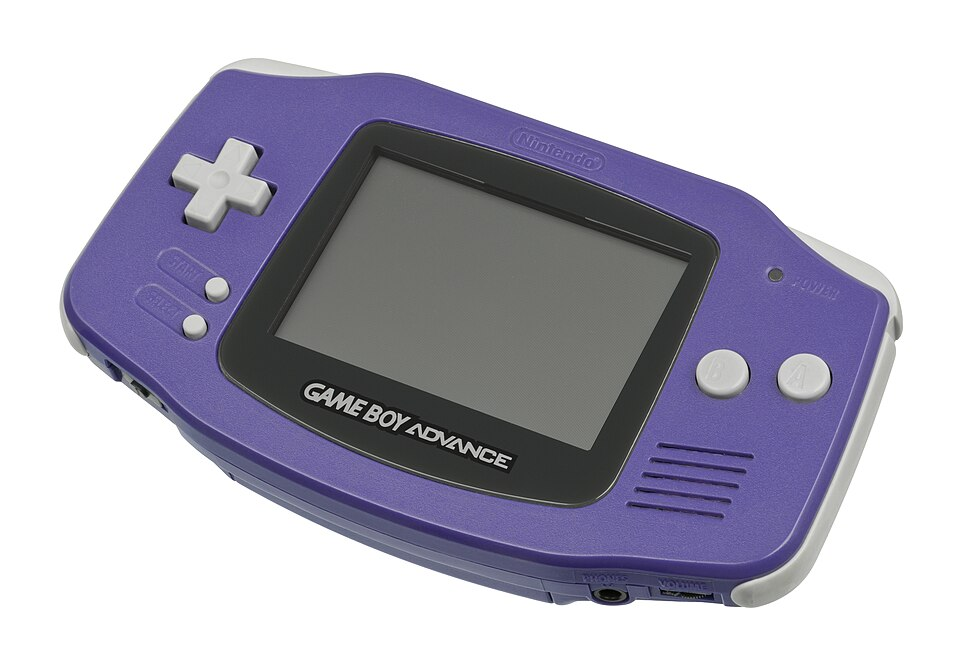
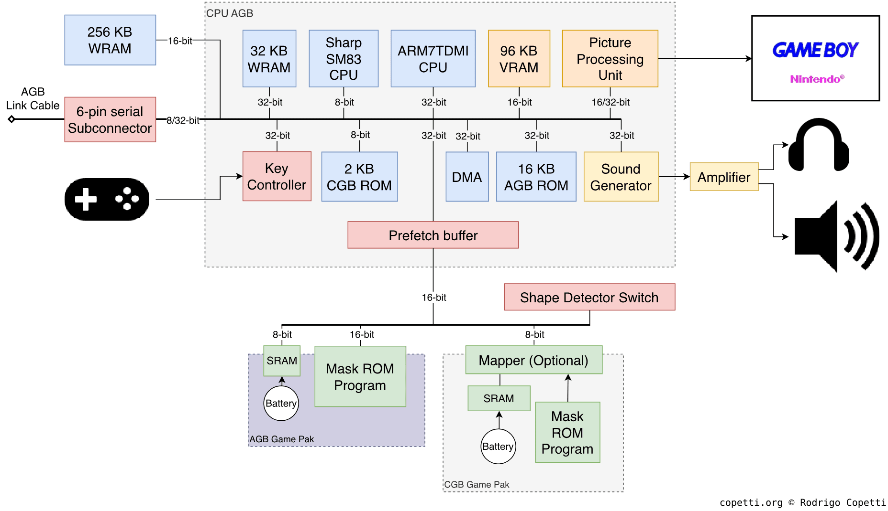
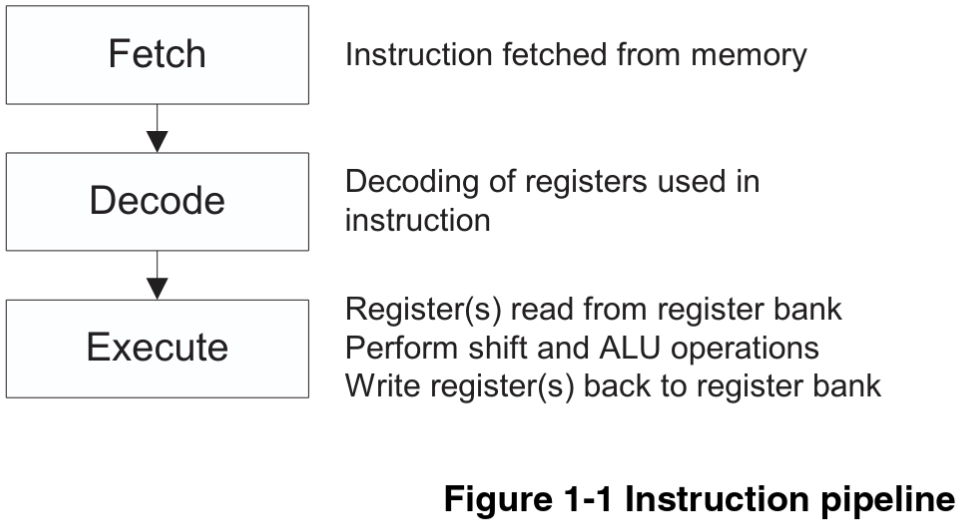
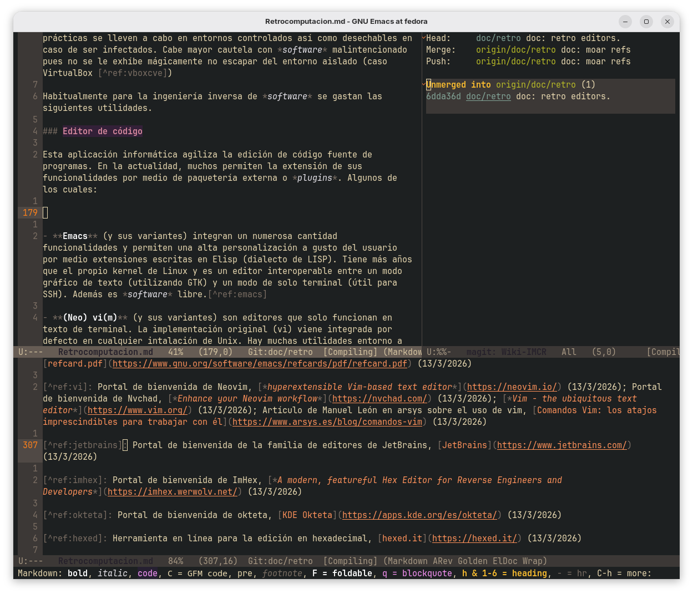
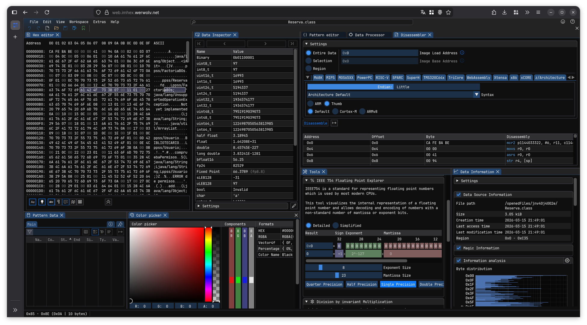
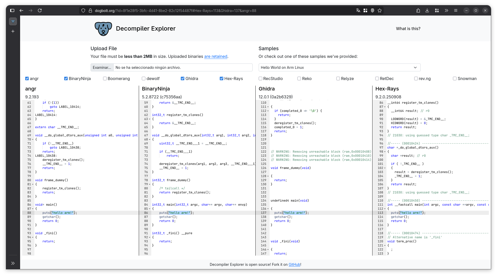

# Retrocomputación en Game Boy Advance

Por *Ivan Parkhomchyk Patapchyk*

!!! danger "Artículo incompleto"
    Este artículo está en proceso de redacción. Pueden existir secciones incompletas, pocas referencias que sustenten lo que se documenta, faltas gramaticales y ortográficas o ausencia de ejemplos.

!!! note "Enfoque de la redacción"
	Este artículo se centra en el análisis técnico y hace uso de herramientas con fines educativos. No para infringir la propiedad intelectual ni la distribución de *software* no permitda.

{ width="300px" } 
/// caption 
Primera revisión del modelo de GBA.
///

La GBA es una consola portátil fabricada, vendida por Nintendo y lanzada en 2001 durante la sexta generación de videoconsolas. Respecto a su antecesora, fue un cambio muy notorio al introducir paleta de colores, mayor resolución, nuevas entradas (botones L y R) y registros de 32 bits (en GB son 8 bits). Todos los títulos de GB son compatibles en GBA y se distribuían en formato de cartucho físico. [^ref:GBAwiki]

## Arquitectura *hardware*

{ width="100%" }
/// caption
Diagrama de arquitectura interna del *hardware* de GBA.
///

El diagrama proporcionado ilustra la arquitectura interna de GBA [^ref:CopettiNDS]. Compuesto por un componente denominado CPU AGB que aglomera componentes importantes para el sistema. Dicha CPU se compone principalmente de dos procesadores:

- Un procesador heredado **Sharp SM83** de 8 bits para títulos de Game Boy (DMG) y Game Boy Color (CGB). 

- Un procesador nuevo **ARM7TDMI** de 32 bits para títulos de GBA.

La razón por la que motiva la inclusión del primer procesador no es otra que la retrocompatibilidad [^ref:CopettiGBA]. Patrón que repetiría en futuras generaciones de consolas por parte de la empresa japonesa tales como NDS [^ref:CopettiNDS] o 3DS [^ref:GVG3DS]. Aunque para el caso de esta última videoconsola el fabricante oculta información sobre ello [^ref:NNoGBAn3DS].

En la GBA solo un procesador está activo pero no a la vez según el cartucho cargado [^ref:CopettiGBA]. Al contrario que en futuras consolas, donde existe una interaoperabilidad activa entre dos procesadores de distinta generación dentro del dispotivo como por ejemplo en la NDS (ARM9 y ARM7) [^ref:CopettiNDS].

### Características de ARM7TDMI

La irrupción que supuso ARM en su época sigue estando todavía más en la actualidad. Con presencia en ordenadores, móviles, videoconsolas y otros dispositivos [^ref:ARMisEVERYWHERE]. Concretamente, el procesador ARM de GBA se rige por una filosofía **RISC** [^ref:ARM7]:

- Instrucciones de tamaño fijo.

- 16 registros de propósito general de 32 bits frente a los 8 de 8 bits en su antecesora [^ref:RetromanDirectoGBYT].

- Ejecución condicional. Esto es que toda instrucción reserva información de si debe ejecuarse o no además de evitar riesgos de control.

- Multiplicación de 32 y 64 bits. Para este último caso, el resultado se reparte en dos registros (Sigla M de TDMI).

- No implementa caché.

- Funcionamineto con 3 voltios.

- Se ejecuta a 16,78 MHz [^ref:Tonc].

- Conjunto de instrucciones **Thumb** (Sigla T de TDMI).

- Facilidad para proporcionar opciones para depurar, concretamente: puerto JTAG y EmbeddedICE (Siglas D y I de TDMI).

#### Cauce

Para maximizar el rendimiento y reducir tiempos muertos, implementa una canalización (*pipeline*) de tres etapas. Esto significa que el ciclo de instrucción se divide en tres etapas distintas que operan simultáneamente sobre tres instrucciones diferentes [^ref:ARM7]:

{ width="700px" }
/// caption
Etapas del cauce de ARM7TDMI: (1) *Fetch* Búsqueda de la instrucción, (2) *Decode* Decodificación de los contenidos de los registros y (3) *Execute* Ejecución de la instrucción (lectura desde el banco de registros, realizar operaciones aritmético lógicas y escritura de vuelta en los registros).
///

De esta forma, mientras la instrucción $A$ se ejecuta, $B$ se está decodificando y $C$ se está buscando. Aumentando el número de instrucciones ejecutadas por tiempo (*Throughput*).

El uso de un cauce superpuesto introduce problemas clásicos de la arquitectura de computadores [^ref:ACIC] que el procesador ARM7TDMI resuelve de formas específicas:

- **Riesgos por dependencias de datos**: Ocurre si una instrucción necesita el resultado de otra anterior que aún no ha terminado. A diferencia de otras arquitecturas de la época que delegaban este problema al programador o al compilador, ARM lo gestiona por *hardware* por inserción de **burbujas**.

- **Riesgos de control**: Cuando hay bifurcaciones en el código. La arquitectura ARM resuelve mediante la **anulación condicional**, es decir, las instrucciones erróneas que ya estaban en el cauce se anulan automáticamente y se convierten en **operaciones de relleno** (NOP), perdiendo ciclos de reloj.

Esta característica convierte al ARM7TDMI en un procesador extremadamente eficiente y hace que la programación a bajo nivel en GBA requiera un enfoque distinto al de otras arquitecturas como x86 o MIPS [^ref:Tonc].

#### Conjunto de instrucciones

Dentro de este procesador existen dos modalidades de operación que habilitan un conjunto de instrucciones y registros diferentes. No obstante, es posible intercambiar el modo funcionamiento durante la ejecución de un programa [^ref:Tonc] [^ref:ARM7] [^ref:CopettiGBA].

=== "ARM"

	- Codificadas en 32 bits.
	
	- Conjunto completo de instrucciones ARM.
	
	- Ofrece ejecución condicional.
	
	- Eficiencia base.
	
	- 16 registros para uso general.

=== "Thumb"

    - Codificadas en 16 bits.
	
	- Son subconjunto (*subset*) de instrucciones ARM.
	
	- No tiene la capacidad de ejecución condicional.
	
	- Más eficientes (al ocupar menos la codificación).

	- 8 registros para uso general.

### Mapas de memoria

La memoria de la GBA se distribuye de la siguiente manera [^ref:Tonc] [^ref:gbatek] :

```
00000000-00003FFF   BIOS (16 KBytes)
00004000-01FFFFFF   Sin uso
02000000-0203FFFF   EWRAM | Work RAM en el cartucho (256 KBytes)
02040000-02FFFFFF   Sin uso
03000000-03007FFF   IWRAM | Work RAM en la placa  (32 KBytes)
03008000-03FFFFFF   Sin uso
04000000-040003FE   IO RAM | Registros de I/O
04000400-04FFFFFF   Sin uso
05000000-050003FF   PAL RAM | Memoria para paletas (2 paletas para 256 entradas con colores de 15 bits) (1 Kbyte)
05000400-05FFFFFF   Sin uso
06000000-06017FFF   VRAM | Video RAM (96 KBytes)
06018000-06FFFFFF   Sin uso
07000000-070003FF   OAM | OBJ Attributes (Control de sprites) (1 Kbyte)
07000400-07FFFFFF   Sin uso
08000000-09FFFFFF   PAK ROM | Game Pak ROM/FlashROM (max 32MB) - Wait State 0
0A000000-0BFFFFFF   PAK ROM | Game Pak ROM/FlashROM (max 32MB) - Wait State 1
0C000000-0DFFFFFF   PAK ROM | Game Pak ROM/FlashROM (max 32MB) - Wait State 2
0E000000-0E00FFFF   Card RAM | Game Pak SRAM (max 64 KBytes) - 8bit Bus width
0E010000-0FFFFFFF   Sin uso
10000000-FFFFFFFF   Sin uso (4 bits más significativos sin uso)
```

### Gráficos

La computación gráfica de la consola es mostrada en una pantalla LCD de 240 x 160 píxeles (relación de aspecto 3:2) y a 60 Hz a través de la PPU (*Pysics processing unit*) [^ref:PanDocs]. Sin embargo y aparentemente la consola puede manejar una pantalla de mayor resolución para el *scrolling*. [^ref:gbaplus2doff] 

Como se ha mostrado antes, hay secciones de memoria dedicadas al rederizado de vídeos: VRAM, OAM, PAL RAM. [^ref:Tonc] [^ref:gbatek]

La GBA reitera alguno de los mecanimos desarrollados en generaciones de videoconsolas anteriores como la GB o la SNES. Pudiendo emplearse para títulos "3D" o puramente bidimensionales. [^ref:CopettiGBA]

#### Mosaicos y *sprites*

Los mosaicos, *tiles* o *bitmaps* son azulejos de vídeo que pueden ser reutilizados para el dibijado de vídeo en dos dimensiones. Los de GBA tienen un tamaño de 8 x 8 píxeles y se almacenan en la VRAM. Pudiendo renderizar 16 colores con 4 bpp (para ocupar menos: 32 Bytes) o 256 colores con 8 bpp (ocupando más: 64 Bytes). [^ref:CopettiGBA]

La unidad PPU trata su renderizado pero espera de antemano su agrupación en *charblocks* (regiones contiguas de 16 KB) y afecta a un tipo capa (*sprites* o fondo). Por las limitaciones de la consola puede manejar hasta 6 *charblocks* (4 para el fondo, y dos para *sprites*). [^ref:Tonc] [^ref:gbatek] [^ref:RetromanDirectoGBYT] [^ref:gbaplus2doff] [^ref:PanDocs]


#### Vídeo 3D

### Cartuchos

## Progamación a bajo nivel. Ingeniería inversa.

La principal dificultad a la hora de trabajar a bajo nivel es que la tarea en cuestión presenta entre poca o nula documentación oficial que especifique el comportamiento en detalle del programa. Es por esta razón poco transparente por la que mucho del *software* es forzosamente descontinuado u obsoleto [^ref:GNUobslent].

> "*Todo el software es de código abierto si sabes ensamblador*." - Anónimo (Atribuida a la cultura hacker de los 90)

La **ingeniería inversa** es el estudio de un servicio final para determinar el diseño del servicio, la interacción entre módulos que lo componen o comportamientos plausibles en general. Los componentes electrónicos y programas informáticos son los que más suelen someterse a este tipo de procedimientos [^ref:REwiki]. Aplicar ingeniería inversa requiere un profundo conocimiento sobre el objeto. Ejemplo clásico: SAMBA-SMB [^ref:SAMBA].

Algunos puntos clave sobre este campo [^ref:RE]:

- Conocimientos a bajo nivel (leer binarios, conocer arquitecturas, *hardware*).

- Proceso muy utilizado en la seguridad e integridad de programas (buscar fallos, violaciones del segmento, filtraciones de memoria...). Por ejemplo: Implementación de mecanismos DRM con Denuvo en videojuegos [^ref:DENUVO].

- Es un trabajo muy bien remunerado por las destrezas requeridas.

- Otros usos: detección de plagio o uso de librerías con licencias inadecuadas, búsqueda de *malware*, reconstrucción de código fuente desde el binario [^ref:RE].

- No obstante, hay *software* que prohíbe la ingeniería inversa dados sus términos y condiciones de uso y/o licencia de uso. Esta debe prevalecer para evitar violar la propiedad inetelectual y la carta de "cese y desista" [^ref:Emucase3].

- La estrategia de **caja negra** es vital para reconstruir comportamientos de programas [^ref:CajaNegra].

En este artículo, nos familiarizaremos con el *tooling* básico que conscierne al desarrollo en GBA. Es muy importante, que este tipo de prácticas se lleven a cabo en entornos controlados así como desechables en caso de ser infectados. Cabe mayor cautela con *software* malintencionado pues no se le exhíbe mágicamente no escapar del entorno aislado (caso de escape del aislamiento de VirtualBox [^ref:vboxcve]) 

Habitualmente para la ingeniería inversa de *software* se gastan las algunas de las siguientes utilidades. Aunque muchos de los programas integran más funcionalidades que solo la que aparece citada.

### Editor de código

Esta aplicación informática agiliza la edición de código fuente de programas. En la actualidad, muchos permiten la extensión de sus funcionalidades por medio de paquetería externa o *plugins*. Algunos de los cuales:

{ width="600px" }
/// caption
Ventana de Emacs editando este artículo.
///

- **(Neo) vi(m)** (y sus variantes) son editores que solo funcionan en texto de terminal. La implementación original (vi) viene integrada por defecto en cualquier intalación de Unix. Hay muchas utilidades entorno a sus variantes en la actualidad por la comunidad. Este es *software* libre y de código abierto. [^ref:vi]

- **Emacs** (y sus variantes) integran un numerosa cantidad funcionalidades y permiten una alta personalización a gusto del usuario por medio extensiones escritas en Elisp (dialecto de LISP [^ref:lpp]). Tiene más años que el propio kernel de Linux y es un editor interoperable entre un modo gráfico de texto (utilizando GTK) y un modo de solo terminal (útil para SSH). Además es *software* libre. [^ref:emacs]

- La familia de editores **JetBrains** tienen licencias de código abiertas comunitarias (con retricciones) y de pago. Solo funcionan bajo un entorno gráfico completo. Son pesados en cuanto al rendimiento. [^ref:jetbrains]

Otras opciones son: Codium, Notepad++, Kdevelop, VS Code, Antigravity, Cursor...

### Visor de hexadecimal

Los programas citados en esta clase de *software* se centran principalmente facilitar el examen a nivel de bytes de archivos binarios.

{ width="1000px" }
/// caption
Ventana de Firefox ejecutando *offline* (esto es posible gracias a *Service Workers* [^ref:websw] y WebAssembly [^ref:webasm]) ImHex [^ref:imhex] en su formato web para examinar un compilado `.class` de Java.
///

- **ImHex** es una navaja suiza multiplaforma de código abierto para este tipo de cuestiones. Puede extenderse su funcionalidad con extensiones, temas, decompiladores... [^ref:imhex] [^ref:moarhex]

- **okteta** es una utilidad más sencilla que se centra en la lectura y edición de binarios. Es libre y trae complementos para convertir datos entre tipos y otros. [^ref:okteta] [^ref:moarhex]

- **hexed.it** se vende como un servicio en línea gratuito (*freeware*) [^ref:moarhex] que sirve para lo mismo pero con funcionalidades restringidas. [^ref:hexed] 

Para una lista detallada de otros programas que cuadren en esta categoría pueden encontrarse en internet. [^ref:moarhex]

### Compilador

El compilador no es más ni menos que un programa que toma código fuente de entrada y lo transforma en otra salida (pudiendo producir binarios, otros fuentes...). [^ref:compiler]

!!! note "En práctica de GBA utilizaremos las utilidades que vienen con el kit de desarrollo"
    Utilizaremos una versión customizada de `gcc` de devkitpro para compilar las ROMs de GBA.

Algunas de las opciones más reconocidas son `gcc`, `clang`, `msvc`, `llvm`. Aunque también cabe considerar otros lenguajes dependiendo del enfoque del área al que se le quiere aplicar la inversa (webassembly, solidity, swift...). [^ref:cppfan]

### Depurador

Aplicación de computadora que permite examinar la ejecución paso a paso de un programa a base de controles sobre este.

!!! note "En práctica de GBA utilizaremos las utilidades que vienen con el kit de desarrollo"
    Utilizaremos una versión customizada de `gdb` de devkitpro para compilar las ROMs de GBA. En la práctica, gastaremos la opción de la depuración remota.

{ width="756px" }
/// caption
Escritorio con `gdb` y el emulador 3DS para depurar un programa *homebrew*. En la captura se aprecia que: en la izquierda un cliente `gdb` está conectado a un *stub* de gdb por emulador, hay un punto de ruptura en la línea 275 (imprimir `loading...\n`, bola roja), ejecución actual en la línea 275 (flecha rosa), creación de otros hilos y con la pestaña de registros de ARMv11 por enseñar. En la derecha, un emulador 3DS controlado por el *stub* del depurador.
///

- **gdb** es un clásico y la opción más estable y estándar de facto en entornos *Unix-like*. [^ref:GDBman]

- **edb** es un depurador usado en la ingeniería inversa. [^ref:edb]

Es posible que alguno de los siguientes programas que aparezcan en secciones posteriores pueda del mismo modo depurar código o hacerlo de forma manual.

### Desensamblador, decompilador

Un decompilador es un programa dedicado a relizar la operación inversa de un compilador. Por medio de la aplicación de conocimientos y heirísticas tratan de traducir código máquina a un plausible código fuente de alto nivel al programador. Esto es una técnica que precisa de tener conocimiento exhaustivos del compilador que se ha hecho servir a un programa y encontrar patrones/rutinas comunes en los programas. Un desensamblador, a diferencia de un decompilador, solo traduce el código máquina a ensamblador. Este último la tarea de decodificar cada instrucción bit a bit. Cabe remarcar que debido a la riqueza de lenguajes de programación que experimentamos hoy en día, existen decompiladores especializados en determinados lenguajes de programación (especialmente, los que utilizan un *bytecode* intermedio). [^ref:decowiki]

No obstante, una decompilación ética debe seguir ciertas normativas legales para evitar infringir leyes y propiedades. [^ref:decowiki]

{ width="2000px" }
/// caption
Ventana de Firefox ejecutando Dogbolt [^ref:dogbolt] para decompilar un ejemplo de hola mundo para Linux ARM. No todos los decompiladores decompilan de misma forma. 
///

A menudo y a parte de proporcionar un código de alto nivel o traducido al ensamblador, estas aplicaciones se suelen complementar con otras utilidades que agilizan la inspección: Detección de tipos, coloreado de código, visualización *strings*, grafo CFG, idenficación de funciones, recocimiento de bibliotecas externas, depuración... [^ref:decmpwiki]

Listado de algunos decompiladores/desensambladores:

- **Ghidra** es uno de los más populares, de código abierto y es desarrollado por la Agencia Nacional de Seguridad de los EE.UU. [^ref:Ghidra]

- **Hexrays / IDA Pro** es un potente decompilador de pago. Cuenta con un gran reconocimiento en el nicho de la ingeniería inversa. [^ref:Hexrays]

- **Cutter / Rizin** es una herramineta reciente de código abierto que integra algunas de las características adicionales. [^ref:rizin]

- **dotPeek** enfocada al examen de ensamblados de .NET. [^ref:dotpeek] [^ref:jetbrains]

- También los hay para Java como **procyon** [^ref:proycon] o **cfr** [^ref:cfr].

Hay recursos enteros en línea dedicados a la decompilación. [^ref:decmpwiki]

### Inspectores de memoria

Aunque también son conocidos como visores o escáneres de memoria, consisten en proporcionar en tiempo de real el estado del mapa de memoria. Habitualmente los programas emuladores ya vienen con esta función. El uso de un visor principalmente, se utiliza para alterar partes de la memoria que afecten a la ejecución o que tengan un impacto secundario. Esta función requiere acceso al *kernel* para monitorear todo y cualquier modificación sin cuidado puede propiciar comportamientos erróneos. [^ref:myref]

Por ejemplo, **Cheat Engine** o **GameConqueror** pueden ser utilizados para hacer trampas. [^ref:ce] [^ref:CHEATS]

### Aislamiento

Es muy aconsejable, cuando hagamos ingeniería inversa hacerlo en entornos aislados o desechables. Pero nunca sobre nuestra máquina si ello implica la ejecución de código malicioso o uno erróneo reconstruido por nosotros. Hay ocaciones en las que es imposible hacer ejecución directamente porque alguno de los componentes del computador del ordenador destino no son compatibles.

Podríamos destacar al menos tres mecanismos [^ref:recursiveRef]:

- La **emulación** posibilita ejecutar programas de arquitecturas *hardware* diferentes a las del equipo original (Por ejemplo: emulación de consolas retro en x86).

- Los **contenedores** simulan un sistema operativo ligero pero con aislamiento de otros programas (Por ejemplo: desplegar en Docker).

- Una **capa de compatibilidad** ejecuta programas de otros sistemas operativos utilizando los mínimo recursos del sistema operativo original (Por ejemplo: ejecutar programas de Windows en Fedora Linux).

#### Legalidad de emulación

Los emuladores en la cultura popular tienden a asociarse como *software* ilegítimo. Pero nada lejos de la realidad, la mayoría son de código abierto y no infringen propiedad intelectual alguna siempre. Además de aclarar la no vinculación con marcas [^ref:GBxEmuWiki]. Numerosas sentencias judiciales han determinado que hacer emuladores es legal [^ref:Emucase1] [^ref:Emucase2] pero no siempre es así teóricamente existen si indicios de violaciones de los derechos sobre la propiedad (utilización de información de *leaks* para obtener una copia temprana) [^ref:Emucase3].

Otra cuestión relativa a la emulación de títulos es la obtención de estos mismo títulos: pues debe hacerse desde una copia de la licencia original (sin permiso de distribución) o *software* casero (habitualmente conocido como *homebrew*). [^ref:Emucase4] 

## Herramientas de desarrollo (práctico)

(Qué sdks hay, devkitpro-supuesto instalado, compilar una rom, emulador, depuración remota (¿para qué puede ser útil?, tuto rápido de uso), visor de memoria)

### Práctica 0: Preparación del entorno inicial. Experimentación. Configuración.

### Práctica 1: Compilación de ROM básica. Ejecución en emulador. Usando el escáner de memoria.

### Práctica 2: Depuración remota. Otras utilidades. Nivel de instrucción.

# Referencias

*[GBA]: consola Game Boy Advance

*[GB]: consola Game Boy

*[CPU]: Microprocesador, procesador, unidad central de procesamiento

*[NDS]: consola Nintendo DS, sucesora de GBA

*[3DS]: consola Nintendo 3DS, sucesora de NDS

*[RISC]: Computador de Conjunto Reducido de Instrucciones, Reduced Instruction Set Computer

*[GDB]: Depurador de GNU, GNU Debugger

*[gdb]: Depurador de GNU, GNU Debugger

*[NOP]: Instrucción a bajo nivel de relleno, que no hace nada, Not Operation

*[JTAG]: Puerto para depuración y pruebas, Joint Test Action Group

*[RAM]: Memoria de acceso aleatorio, Random Access Memory

*[ROM]: Memoria de solo lectura, Read-Only Memory

*[x86]: Aquitectura de computador CISC Intel más extendida en los ordenadores personales, Intel 8086

*[MIPS]: Aquitectura de computador RISC MIPS usada en embebidos, videoconsolas retro

*[BIOS]: Sistema básico de entrada y salida, Basic Input Output System

*[IWRAM]: Memoria interna para trabajo de acceso aleatorio, Internal Work RAM

*[EWRAM]: Memoria externa para trabajo de acceso aleatorio, External Work RAM

*[SRAM]: Memoria estática de acceso aleatorio, Static Random Access Memory

*[SAMBA]: Implementación libre del propietario protocolo y programa SMB

*[SMB]: Sistema propietario de facto para la compartición de carpetas en Windows 

*[GTK]: GIMP Toolkit, conjunto de herramientas para desarrollar interfaces de usuario gráficas muy recurrente en el entorno de escritorio GNOME y XFCE

*[LCD]: categoría de pantalla, *Liquid Crystal Display*

[^ref:GBAwiki]: Artículo de Wikipedia sobre GBA, [Game Boy Advance](https://en.wikipedia.org/wiki/Game_Boy_Advance) (5/3/2026)

[^ref:RetromanDirectoGBYT]: Emisión grabada de Francisco Gallego en YouTube, [Programando videojuegos en ensamblador para Game Boy. Introducción a GBTelera](https://www.youtube.com/watch?v=q552n1F3j9s) (5/3/2026); Repositorio git de Francisco Gallego en github, [GBTelera](https://github.com/lronaldo/gbtelera) (6/3/2026)

[^ref:CopettiGBA]: Artículo traducido de Rodrigo Copetti en su blog, [Arquitectura Game Boy Advance](https://www.copetti.org/es/writings/consoles/game-boy-advance/) (5/3/2026)

[^ref:NNoGBAn3DS]: Pregunta frecuente respondida, [¿Se puede jugar a juegos de Game Boy Advance en Nintendo 3DS?](https://www.nintendo.com/es-es/Ayuda/Consolas-anteriores/-Se-puede-jugar-a-juegos-de-Game-Boy-Advance-en-Nintendo-3DS-242227.html) (9/3/2026)

[^ref:CopettiNDS]: Artículo de Rodrigo Copetti en su blog, [*Nintendo DS Architecture*](https://www.copetti.org/writings/consoles/nintendo-ds/) (5/3/2026)

[^ref:GVG3DS]: Vídeo de John Cartwright en YouTube, [*3DS Can Play Game Boy Advance Games Without Emulation*](https://www.youtube.com/watch?v=_A4gHxhUcGs) (9/3/2026)

[^ref:ARMisEVERYWHERE]: Artículo de xataca, [Comienza la nueva era de los Mac ARM de Apple: qué podemos esperar de los futuros iMac y MacBook](https://www.xataka.com/ordenadores/comienza-nueva-era-mac-arm-apple-que-podemos-esperar-futuros-imac-macbook) (9/3/2026); Artículo de ARM, [*99% of all Smartphones Powered by ARM*](https://www.arm.com/markets/consumer-technologies/smartphones) (9/3/2026)

[^ref:ACIC]: Transparencias en línea sobre el tratamiento de los riesgos de adelantamiento por profesorado de la Universidad Carlos III de Madrid, [Tema 6. Introducción a la segmentación avanzada: Riesgos](https://ocw.uc3m.es/pluginfile.php/3271/mod_page/content/19/riesgos.pdf]) (9/3/2026); Transparencias de las asignaturas Ingeniería de los Computadores y Arquitectura de los Computadores del grado de Ingeniería Informática ofertado en la Universidad de Alicante (9/3/2026)

[^ref:PanDocs]: Documentación técnica en línea de Pan Docs, [*Foreword - Pan Docs*](https://gbdev.io/pandocs/About.html) (7/3/2026); Alternativa de la documentación de Pan Docs en formato PDF, [*Game Boy: Complete Technical Reference*](https://gekkio.fi/files/gb-docs/gbctr.pdf) (7/3/2026)

[^ref:Tonc]: Documentación técnica en línea de Tonc, [*Foreword - Tonc*](https://gbadev.net/tonc/) (7/3/2026)

[^ref:gbatek]: Documentación "ASCII" (solo texto) técnica en línea de gbatek, [gbatek](https://mgba-emu.github.io/gbatek/) (7/3/2026)

[^ref:gbaplus2doff]: Vídeo de Jacob Helgason en YouTube, [* Building World Maps for the GBA*](https://www.youtube.com/watch?v=BSkId3Jq2_U) (19/3/2026)

[^ref:GBA3D]: Vídeo de Guillem Salvadó sobre 3D en GBA en YouTube, [Juegos de Game Boy Advance en 3D](https://www.youtube.com/watch?v=9QtnivesDaM) (6/3/2026); Vídeo de Dimitris Giannakis en Youtube, [*How Graphics worked on the Nintendo Game Boy Advance*](https://www.youtube.com/watch?v=mpNWEbZdXNw) (6/3/2026)

[^ref:ARM7]: Documentación de ARMv7TDMI en formato pdf, [*ARM7TDMI (Rev 3) Core Processor (Product Overview)*](https://documentation-service.arm.com/static/5eb15edd9931941038e01527) (5/3/2026); Documentación de ARMv7TDMI en línea, [*ARM7TDMI (Rev 3) Core Processor*](https://developer.arm.com/documentation/dvi0027/b/arm7tdmi) (6/3/2026); Alternativa de documentación de ARMv7TDMI en el repositorio git de Sasank Chilamkurthy en github, [ARM7](https://github.com/chsasank/ARM7/blob/master/docs/ARM-7TDMI-Reference-Manual.pdf) (6/3/2026)

[^ref:DevkitProGBA]: Enciclopedia en línea para tutoriales por el equipo de devkitPro, [*Getting started*](https://devkitpro.org/wiki/Getting_Started) (5/3/2026); Repositorio git del equipo devkitPro en github, [libgba](https://github.com/devkitPro/libgba) (6/3/2026); Repositorio git del equipo devkitPro en github con herramientas para el desarrollo en GBA, [gba-tools](https://github.com/devkitPro/gba-tools) (6/3/2026); Repositorio git del equipo devkitPro en github con de ejemplos de ROMs GBA, [gba-examples](https://github.com/devkitPro/gba-examples) (6/3/2026)

[^ref:GDBman]: Manual de uso en PDF alojado en el repositorio git en sourcewave, [*Debugging with GDB*](https://sourceware.org/gdb/current/onlinedocs/gdb.pdf) (7/3/2026)

[^ref:GNUobslent]: Artículo de GNU sobre la obsolencencia, [Obsolescencia en el software privativo](https://www.gnu.org/proprietary/proprietary-obsolescence.html#content) (12/3/2026)

[^ref:REwiki]: Artículo de la Wikipedia sobre Ingeniería inversa, [Ingeniería inversa](https://es.wikipedia.org/wiki/Ingenier%C3%ADa_inversa) (12/3/2026)

[^ref:SAMBA]: Página de bienvenida de SAMBA, [Opening Windows to a Wider World](https://www.samba.org/) (12/3/2026)

[^ref:RE]: Transparencias en línea sobre la ingiería inversa por Joxean Koret, [Una Brevísima Introducción a la Ingeniería Inversa](https://joxeankoret.com/download/iniciacion-reversing-tknika-zorrozaurre-2024.pdf) (7/3/2026)

[^ref:DENUVO]: Vídeo de BaityBait en YouTube, [DENUVO: El sistema ANTIPIRATERÍA MÁS POLÉMICO](https://www.youtube.com/watch?v=xnz84dO6-Wg) (12/3/2026); Artículo de GameRynxo sobre Denuvo, [Qué es Denuvo: El Guardián Digital de los Videojuegos Explicado a Fondo](https://game.rynxo.com/como-funciona/que-es-denuvo/) (13/3/2026)

[^ref:CajaNegra]: Artículo de la Wikipedia sobre Pruebas funcionales, [Pruebas funcionales](https://es.wikipedia.org/wiki/Pruebas_funcionales) (12/3/2026); Transparencias de la asignatura Planificación y Pruebas de Sistemas *Software* del grado de Ingeniería Informática ofertado en la Universidad de Alicante (12/3/2026); Artículo de Juan José Santos Chavez sobre pruebas de caja negra, [¿Qué son las pruebas de caja negra? Todo lo que debes saber](https://www.deltaprotect.com/blog/pruebas-de-caja-negra) (12/3/2026)

[^ref:vboxcve]: Artículo explícito de vulnerabilidades CVE sobre VirtualBox, [CVE-2025-30712](https://nvd.nist.gov/vuln/detail/CVE-2025-30712) (15/3/2026)

[^ref:emacs]: Portal de bienvenida de GNU Emacs, [*An extensible, customizable, free/libre text editor — and more.*](https://www.gnu.org/software/emacs/) (13/3/2026); Repositorio git de Doom Emacs en github, [https://github.com/doomemacs/doomemacs] (13/3/2026); Chuleta de Emacs, [refcard.pdf](https://www.gnu.org/software/emacs/refcards/pdf/refcard.pdf) (13/3/2026)

[^ref:lpp]: Apuntes de la asignatura Lenguajes y Paradigmas de Programación del grado de Ingeniería Informática ofertado en la Universidad de Alicante, [Tema 1: Historia y conceptos de los lenguajes de programación](https://domingogallardo.github.io/apuntes-lpp/teoria/tema01-historia-lenguajes-programacion/tema01-historia-lenguajes-programacion.html) (15/3/2026); Seminario de Scheme (dialecto de LISP) de la asignatura Lenguajes y Paradigmas de Programación del grado de Ingeniería Informática ofertado en la Universidad de Alicante, [Seminario 1: Seminario de Scheme](https://domingogallardo.github.io/apuntes-lpp/seminarios/seminario1-scheme/seminario1-scheme.html) (15/3/2026)

[^ref:vi]: Portal de bienvenida de Neovim, [*hyperextensible Vim-based text editor*](https://neovim.io/) (13/3/2026); Portal de bienvenida de Nvchad, [*Enhance your Neovim workflow*](https://nvchad.com/) (13/3/2026); [*Vim - the ubiquitous text editor*](https://www.vim.org/) (13/3/2026); Artículo de Manuel León en arsys sobre el uso de vim, [Comandos Vim: los atajos imprescindibles para trabajar con él](https://www.arsys.es/blog/comandos-vim) (13/3/2026)

[^ref:jetbrains]: Portal de bienvenida de la familia de editores de JetBrains, [JetBrains](https://www.jetbrains.com/) (13/3/2026)

[^ref:websw]: Artículo de MDN sobre *Service Workers* en el navegador web, [*Service Worker API*](https://developer.mozilla.org/en-US/docs/Web/API/Service_Worker_API) (15/3/2026)

[^ref:webasm]: Artículo de MDN sobre WebAssembly en el navegador web, [WebAssembly](https://developer.mozilla.org/en-US/docs/WebAssembly) (15/3/2026)

[^ref:moarhex]: Repositorio git con listados de programas para edición de hexadecimal en github, [awesome-hex-editors](https://github.com/merces/awesome-hex-editors) (15/3/2025) 

[^ref:imhex]: Portal de bienvenida de ImHex, [*A modern, featureful Hex Editor for Reverse Engineers and Developers*](https://imhex.werwolv.net/) (13/3/2026); Repositorio git oficial de WerWolv en github, [ImHex](https://github.com/WerWolv/ImHex) (15/3/2026) 

[^ref:okteta]: Portal de bienvenida de okteta, [KDE Okteta](https://apps.kde.org/es/okteta/) (13/3/2026)

[^ref:hexed]: Herramienta en línea para la edición en hexadecimal, [hexed.it](https://hexed.it/) (13/3/2026)

[^ref:compiler]: *Paper* sobre compiladores por Amit Kasar y Mayuri Dangare en researchgate, [*Compiler And Its Phases*](https://www.researchgate.net/publication/354948523_Compiler_And_Its_Phases) (15/3/2026)

[^ref:cppfan]: Documento sobre el estándar (muy) (y mucho) (bastante) (y contemporáneamente) moderno de C++, [*Modern C++ Programming*](https://federico-busato.github.io/Modern-CPP-Programming/htmls/modern-cpp.html) (18/3/2026)

[^ref:edb]: Página de paquetería y herramientas de Kali Linux [Edb-debugger](https://www.kali.org/tools/edb-debugger/) (13/3/2026)

[^ref:decowiki]: Artículo de Wikipedia sobre decompiladores, [Decompilador](https://es.wikipedia.org/wiki/Decompilador) (18/3/2026)

[^ref:dogbolt]: Recompilación de diversos decompiladores en línea, [Decompiler Explorer](https://dogbolt.org/) (18/3/2026)

[^ref:Hexrays]: Portal de bienvanida de hex-rays, [*IDA Pro: A powerful disassembler, decompiler and a versatile debugger. In one tool.*](https://hex-rays.com/ida-pro) (7/3/2026)

[^ref:Ghidra]: Repositorio git oficial de la Agencia de Seguridad Nacional Estadounidense en github, [*Ghidra is a software reverse engineering (SRE) framework*](https://github.com/NationalSecurityAgency/ghidra) (7/3/2026)

[^ref:rizin]: Respositorio git del equipo rizinorg en github, [*Cutter*](https://github.com/rizinorg/cutter) (7/3/2026)

[^ref:dotpeek]: Portal de bienvenida de JetBrains dotPeek, [dotPeek](https://www.jetbrains.com/decompiler/) (18/3/2026)

[^ref:cfr]: Repositorio git de cfr en github, [*CFR - Another Java Decompiler \\o/*](https://github.com/leibnitz27/cfr) (18/3/2026)

[^ref:proycon]: Repositorio git de procyon en github, [procyon](https://github.com/mstrobel/procyon) (18/3/2026)

[^ref:decmpwiki]: Enciclopedia wiki en línea dedicada a la decompilación, [*Decompiler Directory*](https://decompilation.wiki/decompilers/directory/) (18/3/2026) 

[^ref:myref]: Artículo por Starcube Labs sobre realizar ingeniería inversa en títulos de GBA, [*Reverse Engineering a GBA*](https://www.starcubelabs.com/reverse-engineering-gba/) (18/3/2026)

[^ref:ce]: Artículo de Wikipedia sobre Cheat Engine, [Cheat Engine](https://es.wikipedia.org/wiki/Cheat_Engine) (18/3/2026);

[^ref:CHEATS]: Vídeo de Guillem Salvadó sobre trucos manipulando la memoria en YouTube, [¿Cómo funcionan los CHEAT CODES en juegos?](https://www.youtube.com/watch?v=dNS-lMqfKV0) (18/3/2026); Vídeo de Guillem Salvadó sobre manipulación de RAM en Youtube, [Hackeando Super Mario 64](https://youtu.be/voGN9nx-59Q?si=Vs1rQzTVsm-R0XkQ) (18/3/2026)

[^ref:recursiveRef]: Práctica 1 de Administración de Sistemas Operativos y Redes de los Computadores por Ivan Parkhomchyk Patapchyk en github, [Instalación, implementación y evaluación de sistemas operativos de escritorio](https://github.com/ip61-ua/ASORC/blob/main/practicas/1/document_min.pdf) (18/3/2026) 

[^ref:Lovepotion]: Repositorio git del equipo lovebrew en github, [LÖVE Potion](https://github.com/lovebrew/lovepotion) (6/3/2026)

[^ref:GBStudioSite]: Portal de bienvenida de GB Studio Central, [*A quick and easy to use drag and drop retro game creator for your favourite handheld video game system.*](https://www.gbstudio.dev/) (6/3/2026)

[^ref:GBStudioF500]: Noticia en el blog de GB Studio Central por Emi Paternostro, [*Nike Promotes an Air Jordan Release with Cosmic Climb*](https://gbstudiocentral.com/news/nike-promotes-an-air-jordan-release-with-cosmic-climb/) (6/3/2026); Noticia en el blog de GB Studio Central por Emi Paternostro, [*McDonald’s Celebrates Grimace’s Birthday with a GB Studio Game*](https://gbstudiocentral.com/news/mcdonalds-celebrates-grimaces-birthday-with-a-gb-studio-game/) (6/3/2026)

[^ref:mGBA]: Portal de bienvenida de mGBA, [mGBA](https://mgba.io/) (7/3/2026); Conjuntos de repositorios git relacionados con mGBA en github, [mGBA](https://github.com/mgba-emu) (7/3/2026) 

[^ref:GBxEmuWiki]: Enciclopedia en línea sobre el estado de la emulación, [*Game Boy (Color) emulators*](https://emulation.gametechwiki.com/index.php/Game_Boy_(Color)_emulators) (6/3/2026); Enciclopedia en línea sobre el estado de la emulación, [*Game Boy Advance emulators*](https://emulation.gametechwiki.com/index.php/Game_Boy_Advance_emulators) (6/3/2026) 

[^ref:Emucase1]: Artículo de Wikipedia sobre el caso Sega v. Accolade, [Sega v. Accolade](https://en.wikipedia.org/wiki/Sega_v._Accolade) (7/3/2026)

[^ref:Emucase2]: Artículo archivado del The New York Times sobre el caso Sony v. Connectix, [*Court Says Software Maker Can Emulate Sony's PlayStation*](https://archive.nytimes.com/www.nytimes.com/library/tech/00/02/biztech/articles/11sony.html) (7/3/2026)

[^ref:Emucase3]: Artículo de The Verge sobre sobre el caso Yuzu, [*Nintendo Switch emulator Yuzu will utterly fold and pay $2.4M to settle its lawsuit*](https://www.theverge.com/2024/3/4/24090357/nintendo-yuzu-emulator-lawsuit-settlement) (7/3/2026)

[^ref:Emucase4]: Artículo de McNeelyLaw sobre la legalidad de la emulación, [*https://www.mcneelylaw.com/understanding-the-legal-landscape-of-video-game-emulation/*](https://www.mcneelylaw.com/understanding-the-legal-landscape-of-video-game-emulation/) (7/3/2026)
